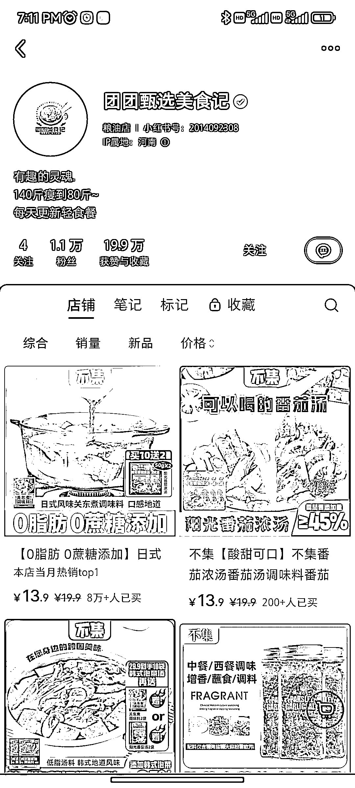
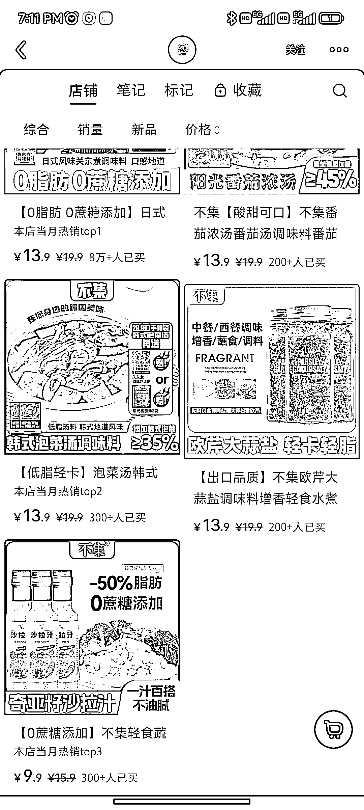
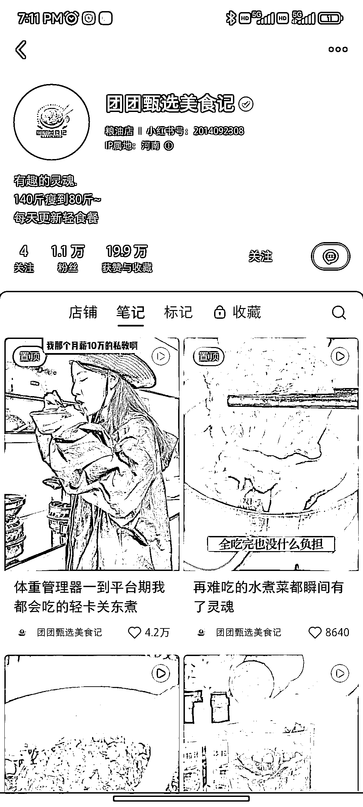
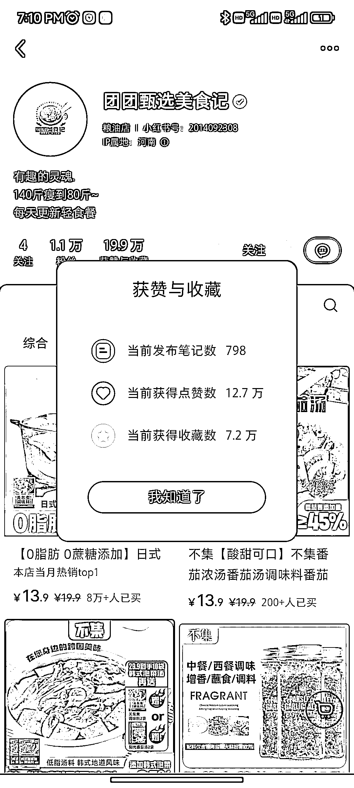

# 万粉美食博主带货调味料，营业额超百万

> 原文：[`www.yuque.com/for_lazy/xkrm14/zy7wcfz9t93hb5mn`](https://www.yuque.com/for_lazy/xkrm14/zy7wcfz9t93hb5mn)

作者： 轶微

日期：2024-03-12

点赞数：**90**

* * *

正文：

万粉美食博主，一百多万的营业额，小红书店铺直接带货调味料。

* * *

评论区：

lgy : 她的视频应该都还是搬运混剪的，出现很多不同人物了

轶微 : 看到好多美食号出 xxx 合集，几种菜品或者一类菜的不同做法，很多都是混剪的

轶微 : 谢谢老大😄

allen : 就 2 个置顶有数据，应该是投流派的

逍遥公子 : 哦，原来这样子，发现好些只有置顶的笔记流量好，其他都少的可怜，一直没明白为啥卖这么好的原因。

* * *

公众号懒人搜索，懒人专属群分享