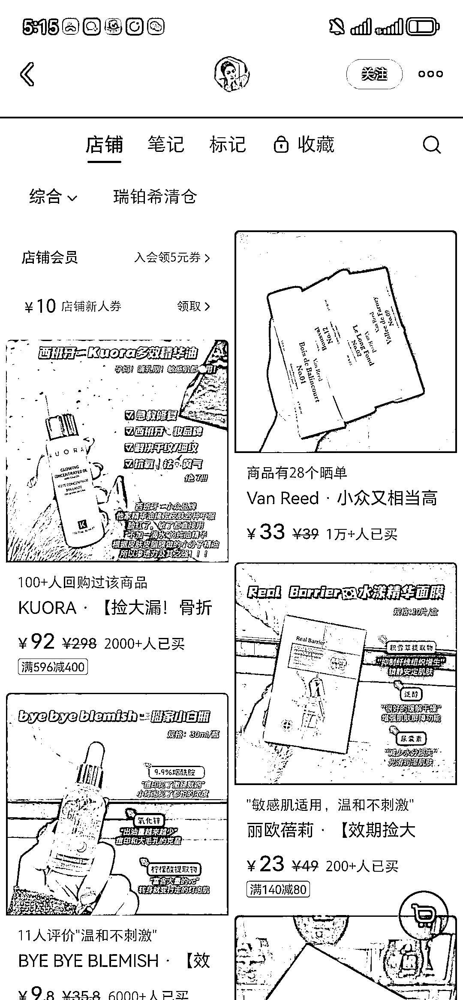
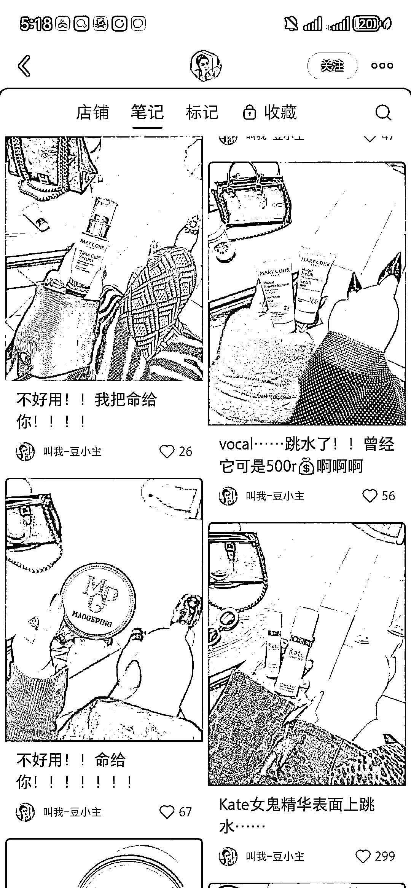
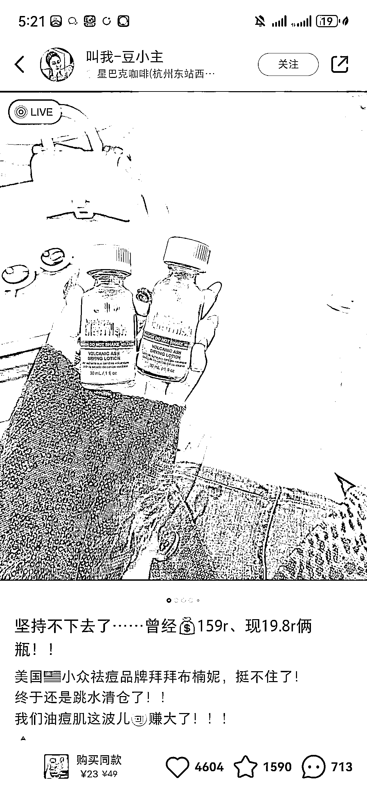

# 同城美妆号运营技巧：定位、图文形式和开店+群聊的成功案例分析

> 原文：[`www.yuque.com/for_lazy/xkrm14/ltnm33v39asc6d6o`](https://www.yuque.com/for_lazy/xkrm14/ltnm33v39asc6d6o)

作者： 陶金金（阎老板）

日期：2024-03-14

点赞数：**77**

* * *

正文：

刷到同城的优质美妆号，这个老板娘很会运营～值得所有老板娘学习哈哈哈 1.每篇笔记都有定位 定位可以让同城的用户刷到他的笔记，可以引流用户去他的实体店。
不过这个用户一般定位的都是商场的星巴克，一二线城市，放定位蛮适合的，因为一二线城市的小红书用户是非常多的，且用户刷本地生活刷的比较狠，定位本身是除了在发现页可以刷到还可以刷附近刷到，多了一个流量入口之外，定位市中心的高端商场，也在缩小同城用户差异化，更高匹配自己更精准的那一波高端用户美妆人群
2.图文形式，live 图 Live 动态图能够非常抓人的眼球，会有真实感，还会拉近距离，既有图文的高级感，又有视频的真实感，这种形式在 2023 年还是蛮火的，
可以看下这个博主在动态的瞬间做了什么样的动作，比如拍滴乳液，live 拍摄能留住流动的动态， 能很好地诠释产品的质量 3\. 开店+群聊
很明显，这个博主就是通过线上售卖，也通过群聊引流到私域，不会浪费一丁点流量 4.模版
我们都讲究小红书的爆款，它一定是有模板的。可以看到这个人的模板就是在一张桌子旁边翘一下腿，看一下他的实物。重点是他的丝袜和包包是比较引人注目的（封面里穿搭的颜色饱和度特别高，视觉上应该会让你留住 1 秒了）
还是女人懂，女人知道女生想要的是什么，越是想要高级的东西，不就是越想满足自己的那点虚荣心嘛。
从图片也是能够有这种隐隐约约的精神层次的传递，比如包包的 logo，丝袜的颜色，还有那超级带钻的美甲，包括衣服、鞋子等等，都是在衬托他的产品，甚至说你都分不清哪个才是主体物，所以后面会跟几个产品的详情图和介绍（这小心机真的非常到位）
5.其他
文案部分，我觉得写的挺生硬的，就是比较产品经理的感觉。香水 AI 写出来的，但这个不重要，因为他的这个账号出圈的点是因为图片和标题，大家一看就能懂，就看了图片和标题，基本上都不会看文案太多的细节
货盘方面是在拿清仓当噱头，美妆清仓这 4 个字在美妆赛道就非常有吸引力，但重点是你能够有可以清仓的价格和高质量的产品才能玩的起来，所以这个老板娘还是蛮有优势的
小红书开店+群聊+定位=​公域卖货+引流私域+本地生活，大家也可以根据自己的产品把自己的小心机耍起来，一定要善于借鉴和学习

* * *

评论区：

Tentacion : 有没有这种货资源的圈友

逍遥公子 : 这店主厉害的，去看了下，她矩阵。

佳妍 : 有的，美妆日化库存临期尾货，加 v:15812902933

陶金金（阎老板） : 太会了～

* * *

公众号懒人搜索，懒人专属群分享