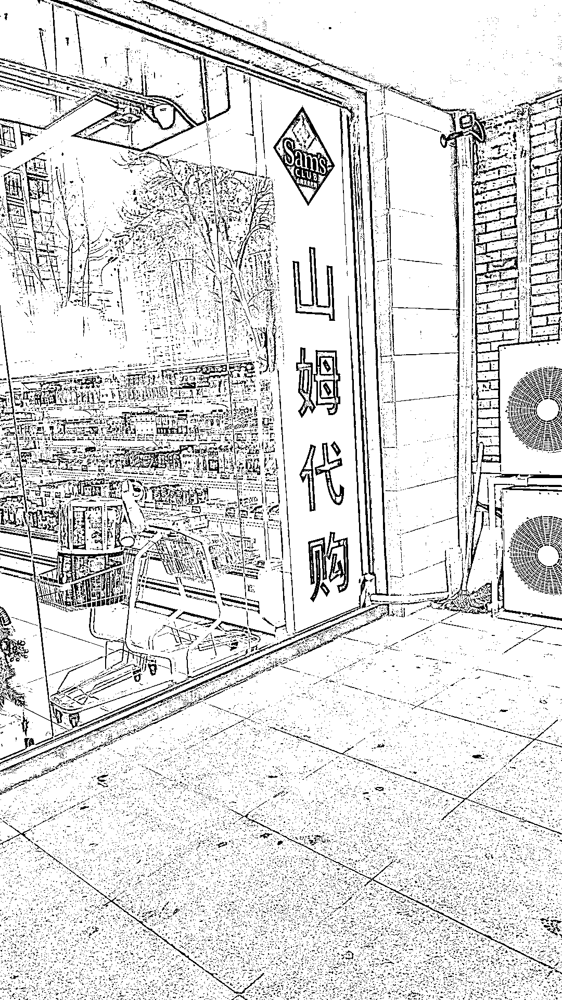
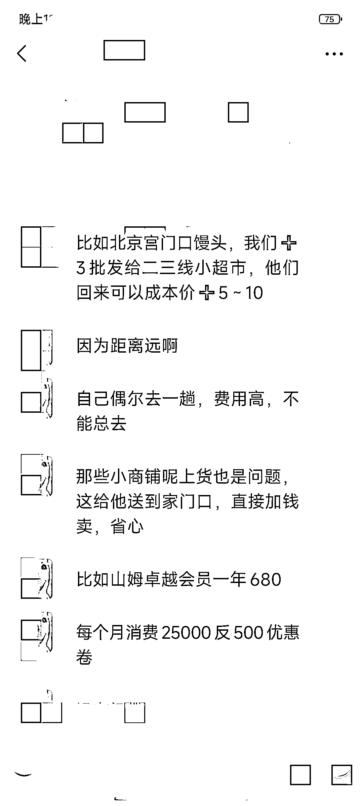

# 山姆士代购市场潜力巨大，年利润百万，胖东来代购也有发展空间

> 原文：[`www.yuque.com/for_lazy/xkrm14/ngg5f8y9bol9gqn1`](https://www.yuque.com/for_lazy/xkrm14/ngg5f8y9bol9gqn1)

作者： 副业校长

日期：2024-03-14

点赞数：**46**

* * *

正文：

山姆士代购，美食代购，胖东来代购。
山姆士目前只有一线，部分二线城市有店，很多小城市的人有购买需求但又不方便购买。而且需要办理会员卡才能进超市买。于是就产生了代购需求。目前了解到做的好的是山东的一家，单店年利润百万左右。已经发展开了部分加盟店。有认识的在北京周边城市做，单店利润 50 万+/年，代购一件 5 元起步，每天开车去北京采购。除了山姆代购，已经延伸到大城市的一些网红美食，饮品等。也有的已经拓展到胖东来代购。有兴趣的可以详细去调研了解。

* * *

评论区：

* * *

公众号懒人搜索，懒人专属群分享