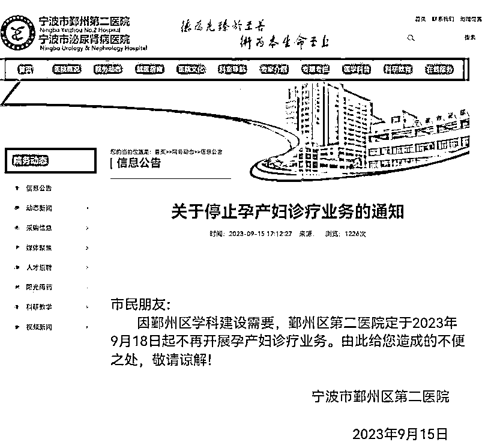
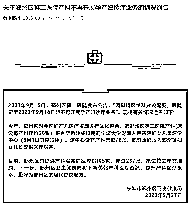
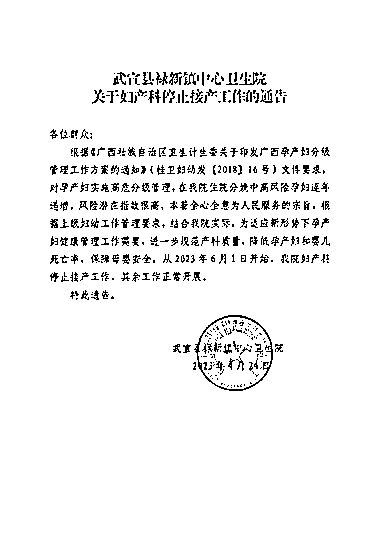

# 多家医院停止产科服务，布局母婴产业需提前做好风险转移

> 原文：[`www.yuque.com/for_lazy/xkrm14/ruigw2bdaz24kdnp`](https://www.yuque.com/for_lazy/xkrm14/ruigw2bdaz24kdnp)

作者： 林林 AIGC 写作

日期：2024-03-15

点赞数：**53**

* * *

正文：

2024 年以来，又有多家医院停止产科服务。建议布局母婴产业的赛道的圈友提前做好风险转移。
江西赣州市第五人民医院公告称，根据医院学科发展规划，自 2024 年 3 月 11 日起我院停止产科服务。浙江江山市中医院也宣布，根据医院产科业务实际情况，自 2024 年 2 月 1 日起，本院不再开展产科（平产、剖宫产）业务。
广东惠州惠康医院介绍，定于 2024 年 2 月 1 日开始，停止产科住院分娩服务。
山东青岛市黄岛区第二中医医院也表示，为适应新形势下孕产妇健康管理工作，保障母婴安全，结合我院实际，我院自 2024 年 1 月 1 日起暂停产科住院分娩服务。

* * *

评论区：

猎鲸者 : 以后要去哪里生孩子？

华龙 : 回归传统，找个接生婆烧锅热水家里生

林林 AIGC 写作 : 你发个接生婆的风向标试试看[捂脸][捂脸][捂脸][捂脸][捂脸]

* * *

公众号懒人搜索，懒人专属群分享