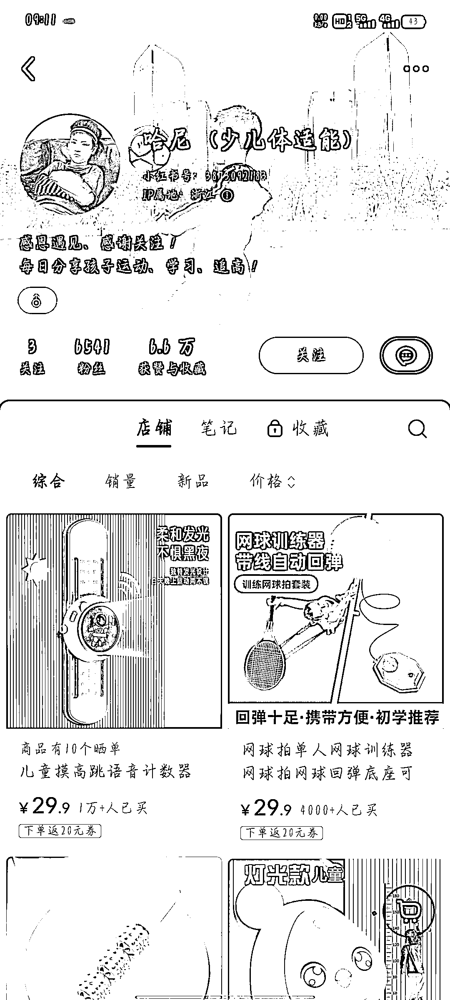
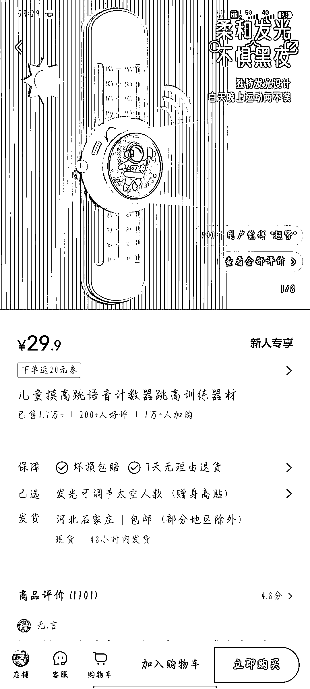
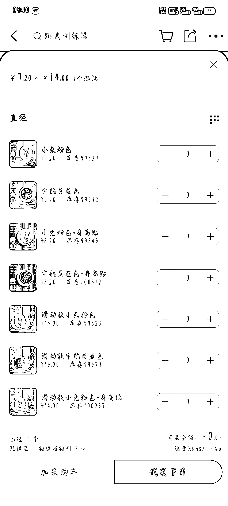
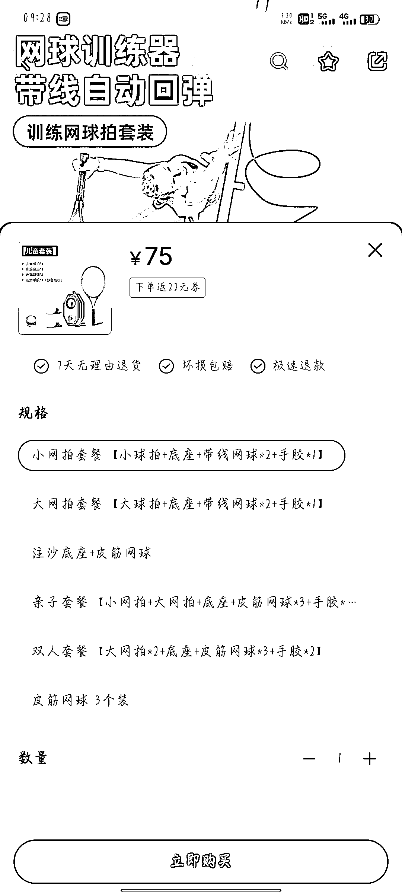
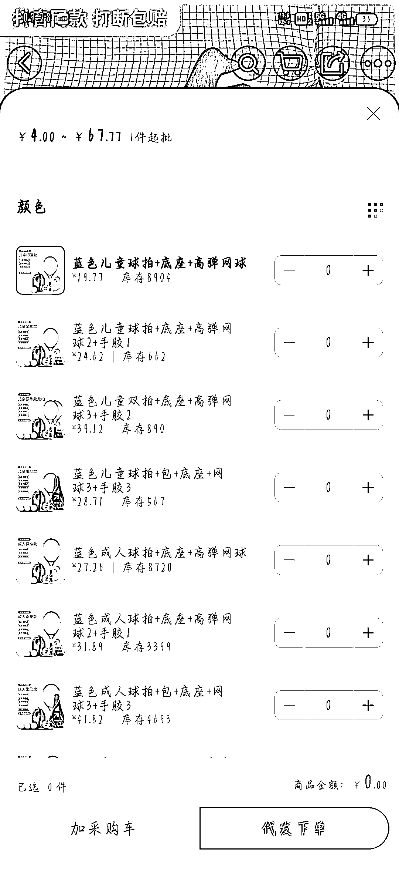
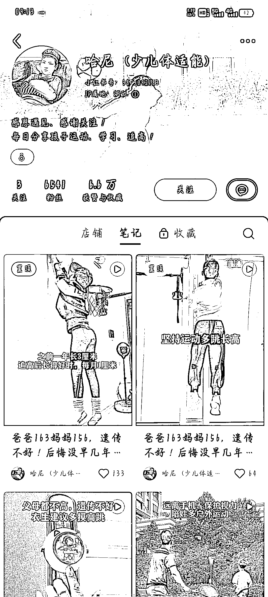
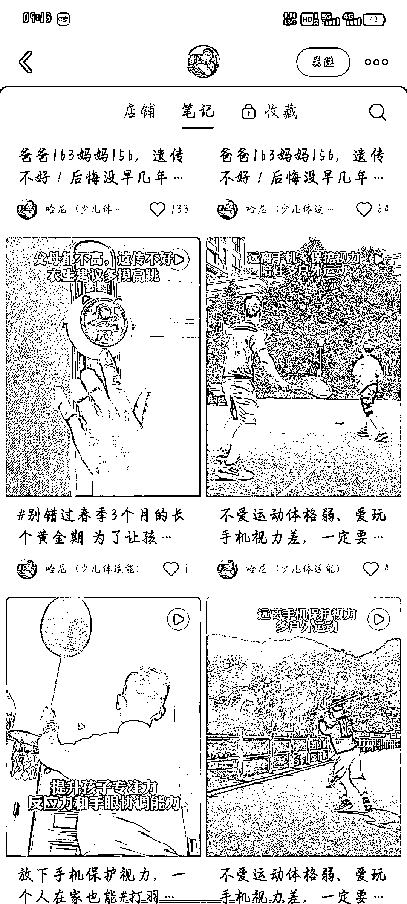

# 小红书儿童训练器材：摸高器和网球训练器，销量高利润可观

> 原文：[`www.yuque.com/for_lazy/xkrm14/bwyu7ag221gyphqc`](https://www.yuque.com/for_lazy/xkrm14/bwyu7ag221gyphqc)

作者： 彼岸

日期：2024-03-14

点赞数：**83**

* * *

正文：

平台和项目：小红书卖摸高器、网球训练器等儿童训练器材 产品卖点：家长希望孩子长高，远离手机，保护视力，多运动等
发的视频都是十来秒的孩子运动视频，可以批量剪辑，容易复制
盈利：摸高器小红书单价 29.9，1688 代发加运费价格 12 元左右，利润 17.9，销量 1.7 万+，利润得有 30 万
网球训练器单价 75 起，1688 代发 24.62，销量 4000+，利润也有 20 万

* * *

评论区：

* * *

公众号懒人搜索，懒人专属群分享