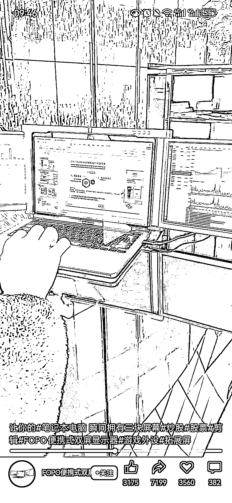

# 视频号刷到一个便携折叠屏，直击商务用户群体痛点

> 原文：[`www.yuque.com/for_lazy/xkrm14/otelca2eg5f1e7hd`](https://www.yuque.com/for_lazy/xkrm14/otelca2eg5f1e7hd)

作者： Elaine

日期：2024-03-18

点赞数：**29**

* * *

正文：

视频号刷到一个便携折叠屏，直击商务用户群体痛点，评论区各种询价 1、这个品能爆，说明视频号上的商务群体的需求值得挖掘，并且还是高客单
2、评论区一大堆国外 IP 问价的，做出海业务的圈友可以关注一下视频号这个平台，在海外平台能爆的品，同样也可以拿到视频号上针对这部分用户群试试

* * *

评论区：

槿🌸做个喜欢的自己 : 礼貌问一下，为啥视频号这么多外国人看[调皮]

Elaine : 有 WeChat

Elaine : 🌹🌹

槿🌸做个喜欢的自己 : wechat 主要在哪些国家流行呢？用户量多不多？[抱拳][抱拳][抱拳]

* * *

公众号懒人搜索，懒人专属群分享