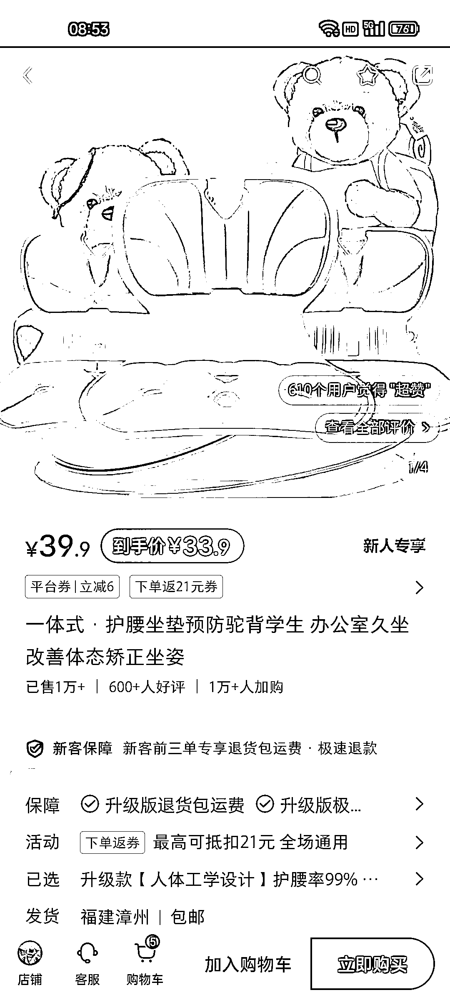
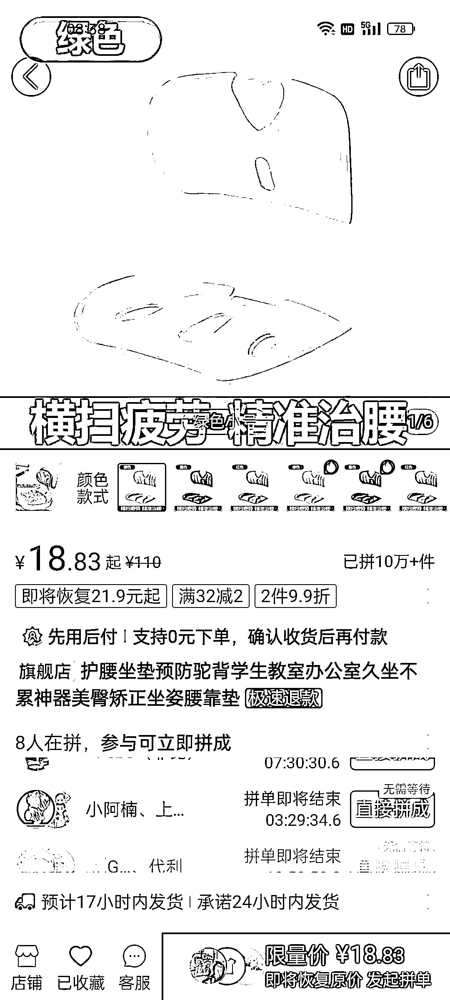

# 小红书平台：预防驼背、改善体态的爆款产品，利润可观

> 原文：[`www.yuque.com/for_lazy/xkrm14/ggpgxhwv0ectwcxg`](https://www.yuque.com/for_lazy/xkrm14/ggpgxhwv0ectwcxg)

作者： 路朝

日期：2024-03-19

点赞数：**71**

* * *

正文：

平台赛道：小红书 目标人群：想要保护腰部，预防驼背及改善体态的人 需求：学生预防驼背，办公室人员改善体态 盈利模式： 这个品类基本都是低粉的小爆品
粉丝量基本都是几百，但该品的销量都在 5k-1w+ 多多上售价在 18+左右，阿里巴巴上售价 13+，小红书上售价 33+，利润还是可观的

* * *

评论区：

才 : 多次见到这个产品

黄莉莉 : 经常见这个品

小查 Charles : 我也经常见到，这个玩意真的有用吗？

胖大魔 : 打铁还需要自身硬，用的时候能维持

* * *

公众号懒人搜索，懒人专属群分享