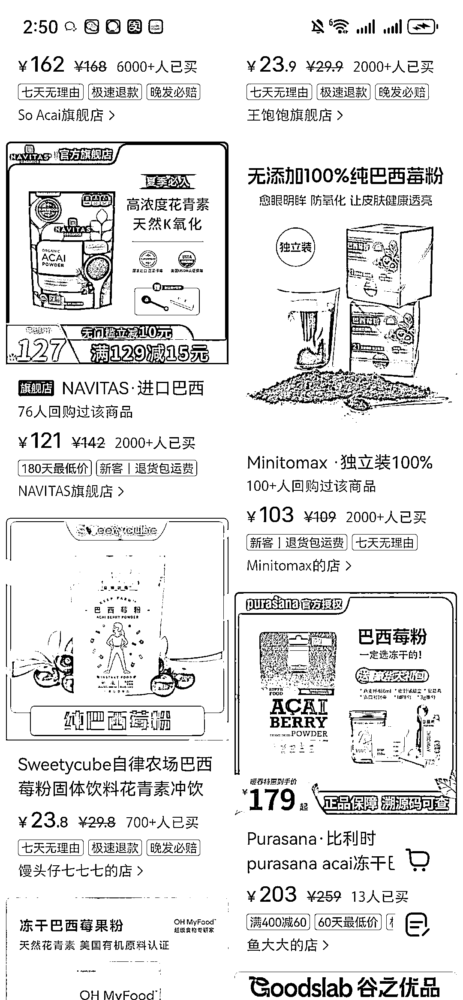
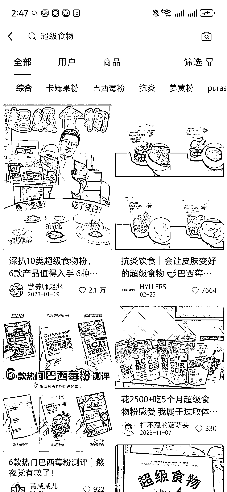
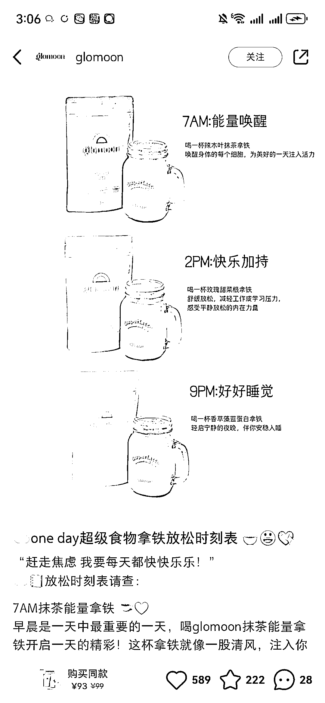

# 小红书的一个蓝海赛道，主打超级食物，超级食物

> 原文：[`www.yuque.com/for_lazy/xkrm14/we300mctgyn0r4b9`](https://www.yuque.com/for_lazy/xkrm14/we300mctgyn0r4b9)

作者： 陶金金（阎老板）

日期：2024-03-18

点赞数：**59**

* * *

正文：

小红书的一个蓝海赛道，主打超级食物，超级食物 代表： 亚麻籽 巴西莓粉 羽衣甘蓝粉 （听起来是营销噱头，但不得不说，有用）
超级实物是指某种生物素含量很丰富，超级实物可以简单高效的解决摄入不足的问题（人群：减肥的，亚健康的，爱美人群） 卖点有点多！（往哪营销都行）
我看不少账号靠纯自然流就爆单，人群大都是轻食人群（小红书很贴合呀）一二线城市的女孩都追求塑身/自律/减肥/变美/无脑入手哈哈哈
且这个赛道，超级食物，客单价高，具备复购率，用户粘性强，口碑传播强，不要小看数量不多，但是这些人，如果引流到私域，那复购率是极强的，客单价也是极高的
我看了下很多都是旗舰店，个人店少，对我们来说是机会也是挑战

* * *

评论区：

倾听晚风 : 感谢分享，这个品感觉可以关注[得意]

陶金金（阎老板） : 是的

黄莉莉 : 感谢分享

金鎶鎶 : 感谢分享

* * *

公众号懒人搜索，懒人专属群分享