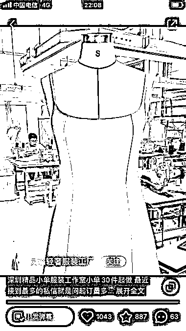
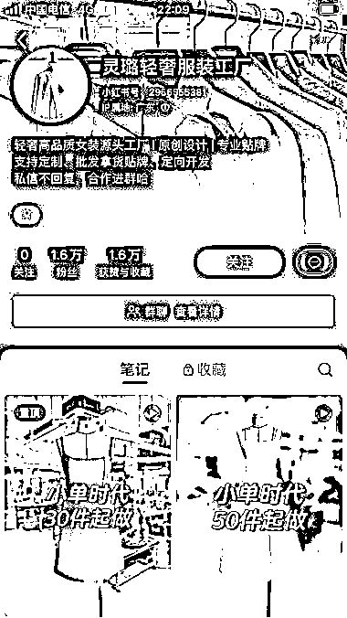
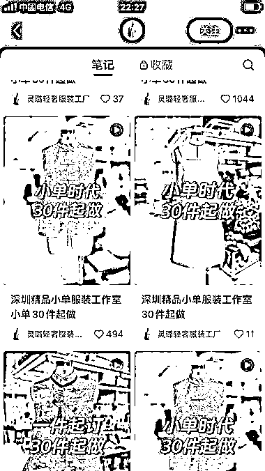

# 小红书：真实工厂车间展示，直击目标客户痛点

> 原文：[`www.yuque.com/for_lazy/xkrm14/togigkc2ei5goe1t`](https://www.yuque.com/for_lazy/xkrm14/togigkc2ei5goe1t)

作者： W.

日期：2024-03-19

点赞数：**44**

* * *

正文：

①背景的展示出真实的工厂车间，提高目标群体的信任度； ②文字简单明了，直击客户群体的痛点“小单” 统一模板，持续输出。 评论很多意向客户咨询。

* * *

评论区：

* * *

公众号懒人搜索，懒人专属群分享