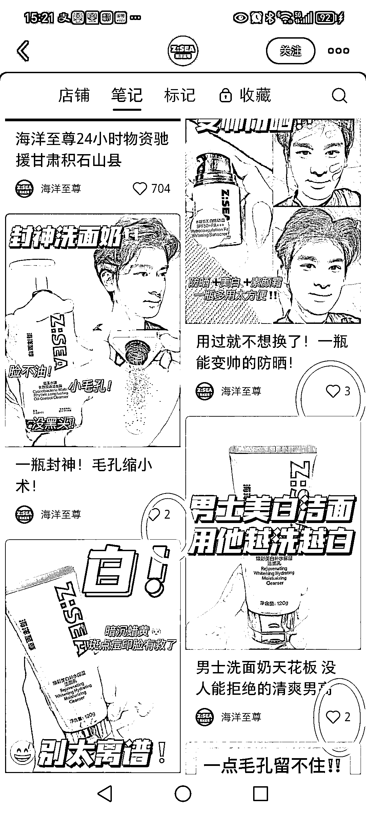
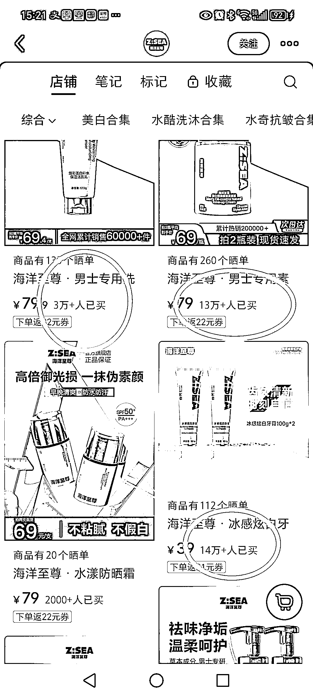

# 小红书不只是女性用品卖得好，男生化妆品也很好

> 原文：[`www.yuque.com/for_lazy/xkrm14/fyiu0ixklfbnocmc`](https://www.yuque.com/for_lazy/xkrm14/fyiu0ixklfbnocmc)

作者： 远方

日期：2024-03-18

点赞数：**36**

* * *

正文：

谁说小红书只是女性用品卖得好，我和他急。下面这个专卖男生化妆品的，每个笔记点赞个位数，店铺里每个品销量五六位数[色]

* * *

评论区：

Darren : 会不会是别人带出去的 [撇嘴]

远方 : 此账号下的小红书店铺商品别人可以带货？要不销量数字可黑科技？没弄过小红书店铺，数据真实性希望行家释疑。

加麻 : 可以的

Adrian : 这个品这个赛道一般人玩不了，这个是大量种草的结果

默默在学习 : 猛砸信息流广告的

昊东.Lee : 销量数据需要去做验证，一是及时性验证；二是需求普适性验证；三是数据真假性验证。可以用工具看一下后台数据。

* * *

公众号懒人搜索，懒人专属群分享