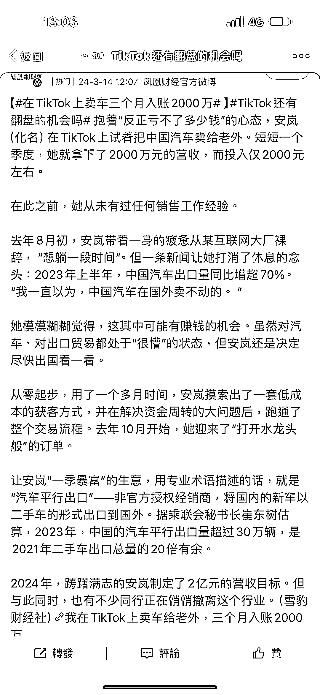

# 在 TikTok 上卖车三个月入账 2000 万

> 原文：[`www.yuque.com/for_lazy/xkrm14/zg4shw9tpro7k535`](https://www.yuque.com/for_lazy/xkrm14/zg4shw9tpro7k535)

作者： 陈白羊

日期：2024-03-19

点赞数：**55**

* * *

正文：

TK 卖车

* * *

评论区：

解放周 : 掘金中东

彭彭 penny : 这篇文章我之前读过，后面还有一段话是这样写的，供参考：
“1)信息差被逐渐抹平，是差价消失的原因之一。高鹏回忆，一直到去年 10 月，他的俄罗斯客户都不懂退税是什么。但两个月之后，几乎所有客户都知道退税的事了，这导致他在交易中需要将税点金额提前算到订单总金额中，然后为客户垫付，相当于让税点。
2)觅食者越来越多也加速了差价的消失。据高鹏估算，在他入局之初的 2023 年 4 月，有约 800 家中国公司从事向俄罗斯市场出口汽车的业务，到年底，这一数字已至少增加到 2000 家。
3)自 2023 年 7 月起，长城、比亚迪相继宣布在乌兹别克斯坦实现本地化生产和建厂。高鹏的判断是，“现在已经供过于求了”。方超则表示，自己之所以没去对新能源汽车更友好的东南亚市场，就是因为比亚迪和哪吒都在该地区建了厂，并建立了销售网络。”

陈白羊 : 哇，谢谢亦仁大大，第一次中标[偷笑]

* * *

公众号懒人搜索，懒人专属群分享