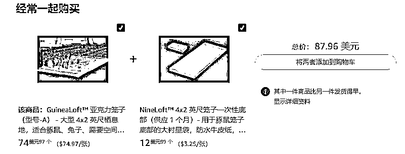
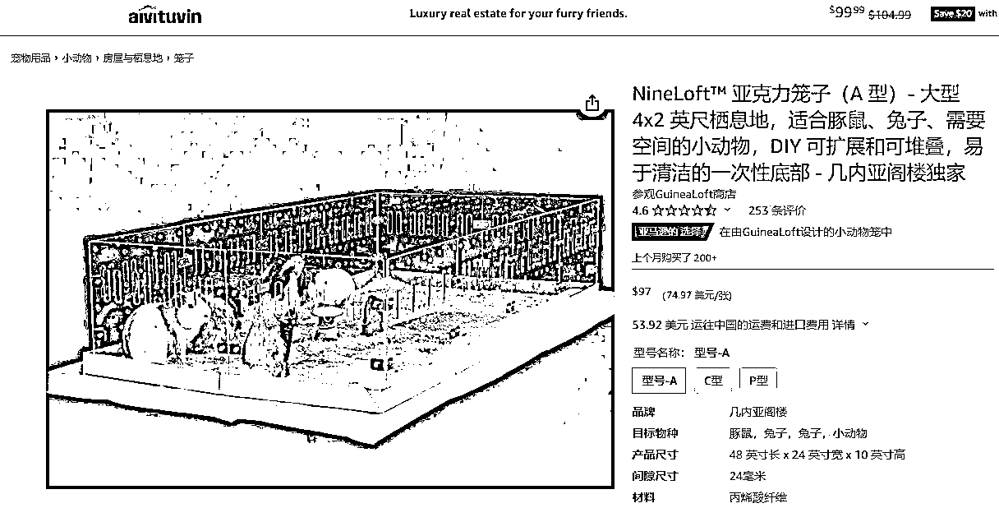
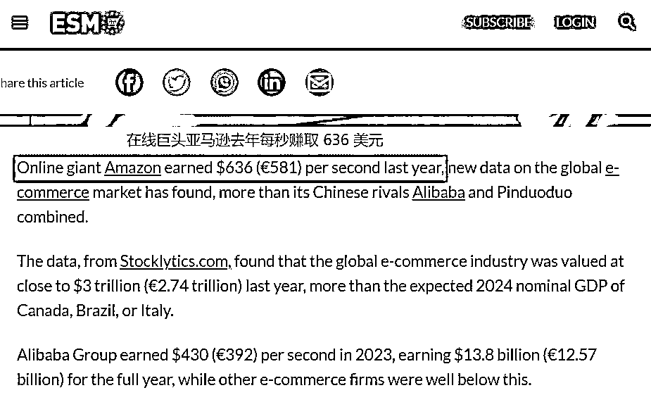

# 17 岁高中生在亚马逊小众赛道赚得盆满钵满，一年收入 300 万

> 原文：[`www.yuque.com/for_lazy/xkrm14/qtov8q9sw5ofpi54`](https://www.yuque.com/for_lazy/xkrm14/qtov8q9sw5ofpi54)

作者： 北柱

日期：2024-03-20

点赞数：**47**

* * *

正文：

亚马逊平台小众赛道的机会，小众赛道虽然需求相比热门赛道要小，但市场竞争也要远小于后者。 美国有一名叫 Bella
Lin 的 17 岁华裔女生，她通过设计豚鼠笼在亚马逊上开店销售，赚得盆满钵满。
在 2022 年，她的“GuineaLoft”透明豚鼠笼卖出了将近 11000 只。到了 2023 年，她靠这个产品赚了 41 万美元（约合 300 万元），平均月收入为 3.4 万美元。
[17 岁高中生在亚马逊做副业，一年赚了 300 万](https://mp.weixin.qq.com/s/eeo1NTmVmvGjLaq8q8tXlQ)

* * *

评论区：

速影 : 把自己作为客户研发喜欢的产品

北柱 : 精辟，确实如此，自己遇到的问题或许还有很多人也遇到了，满足自己的需求的同时很有可能也满足了他人的需求。[机智]

* * *

公众号懒人搜索，懒人专属群分享