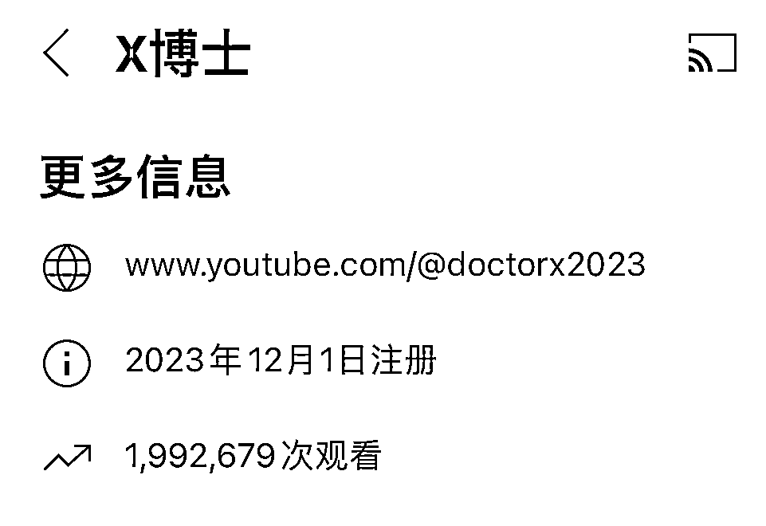

# 做 B 站拿不到结果的话，赶紧换到 Youtube 试试看

> 原文：[`www.yuque.com/for_lazy/xkrm14/ydf7df2kz8uxa8gt`](https://www.yuque.com/for_lazy/xkrm14/ydf7df2kz8uxa8gt)

作者： 林林 AIGC 写作

日期：2024-03-18

点赞数：**34**

* * *

正文：

做 B 站拿不到结果的话，赶紧换到 Youtube 试试看吧。
X 博士的 Youtube 做了快 4 个月了，经常有海外华人慷慨打赏，整体规模相当可观。现在很多自媒体人在国内接不到广告，出海发展也是不错的出路。
我看了一下他们的选题，如果换成在本土内容平台，这些题材的敏感层度不至于让他们遇上官非，但是平台也不敢给他们大胆推流。

* * *

评论区：

* * *

公众号懒人搜索，懒人专属群分享