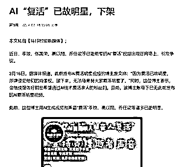
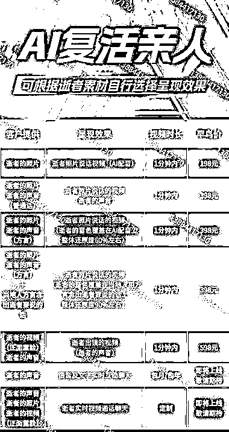

# AI 复活已故明星项目被干预，但复活亲人市场仍是红利

> 原文：[`www.yuque.com/for_lazy/xkrm14/qmzma9b27inmnhnr`](https://www.yuque.com/for_lazy/xkrm14/qmzma9b27inmnhnr)

作者： 掌柜丨湖北丨传统转型

日期：2024-03-19

点赞数：**77**

* * *

正文：

有些项目的消失，是必然。
前几天爆火的项目《AI“复活”已故明星》，把科比、乔任梁、张国荣、李玟等明星用 ai 复活，满足了很多粉丝的痛点，没多久官方就出手干预，因为侵犯了肖像权，哪怕已故的名人，也不行。
不过赛道依然是红利，通过 AI 技术复活亲人市场很大。 平均单价在 198-398 之间。 有能力的可以去专研。

* * *

评论区：

* * *

公众号懒人搜索，懒人专属群分享