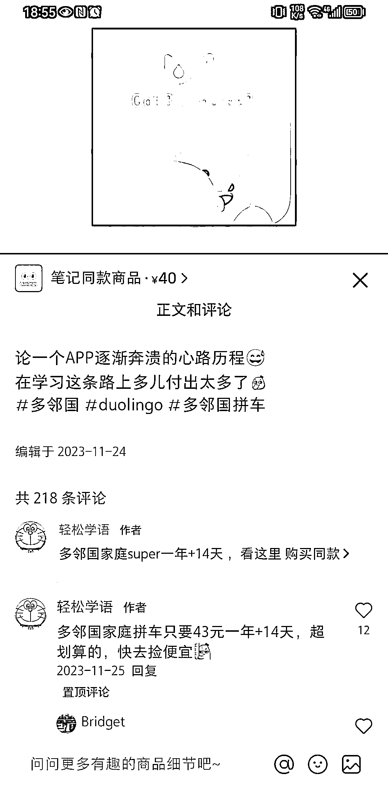
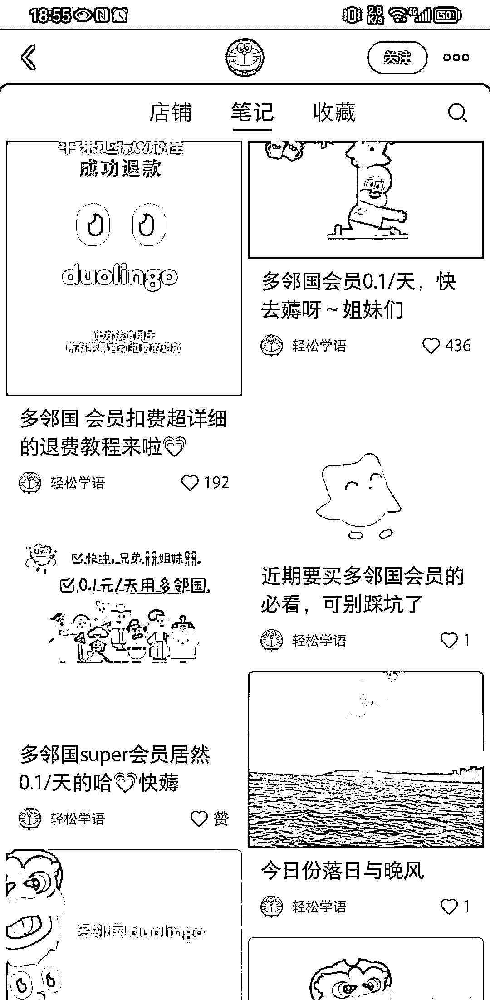
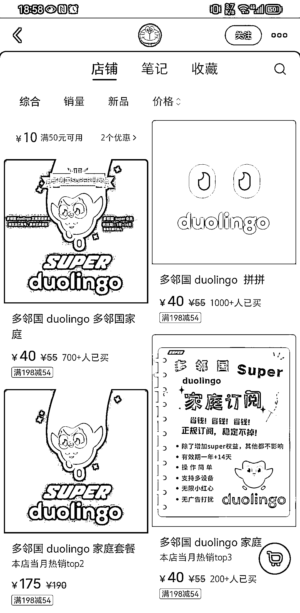

# 学语言的小生意：多邻国会员拼车赚取 80000

> 原文：[`www.yuque.com/for_lazy/xkrm14/dpfimihu9272mq35`](https://www.yuque.com/for_lazy/xkrm14/dpfimihu9272mq35)

作者： 波本零

日期：2024-03-21

点赞数：**74**

* * *

正文：

学语言的一个小生意 最近在用多邻国学小语种，每次打完卡后 app 都会提醒我买一个会员。 我在犹豫我到底要不要买，于是我在小红书搜“super
duolingo 有必要买吗”。
本以为看到的都是素人笔记的讨论，没想到刷着刷着就看到有商家把多邻国会员拼车做成了一个生意，店铺商品价格在 40 上下，销量已经有 2000 多，起码赚了 2000*40=80000。
还算是个蓝海市场，竞争度很低。

* * *

评论区：

就是塔塔 : 我在闲鱼买的 27 一年销量也很高

阿 : 我看有的网站会发布绿化版的，不知道和付费版用起来一样不一样[囧]

* * *

公众号懒人搜索，懒人专属群分享