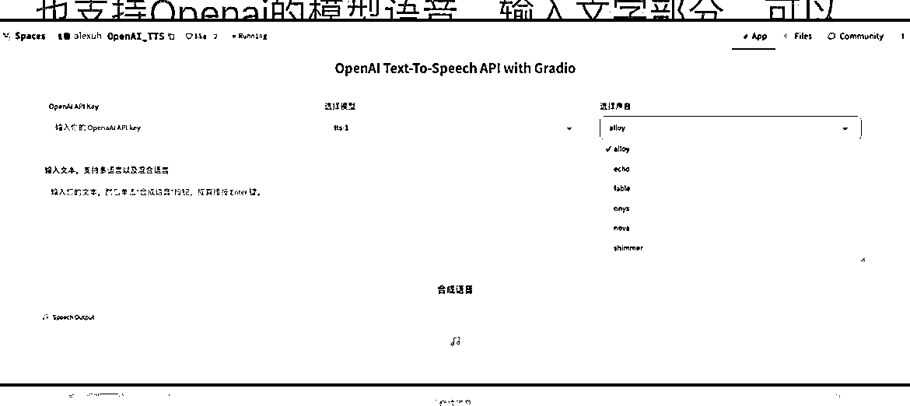
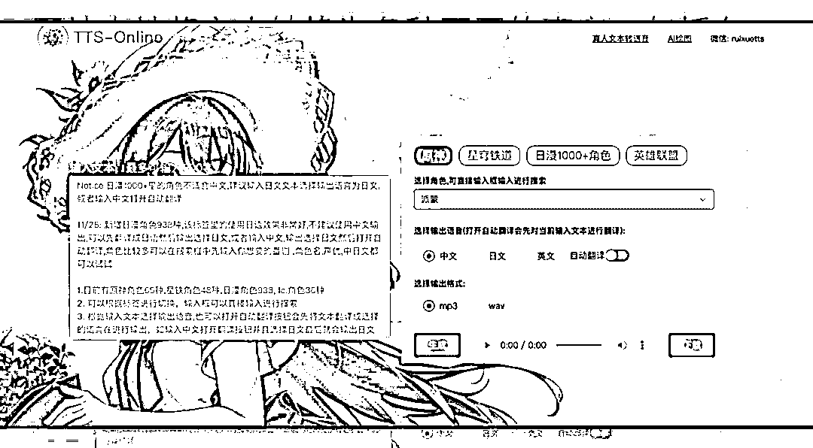
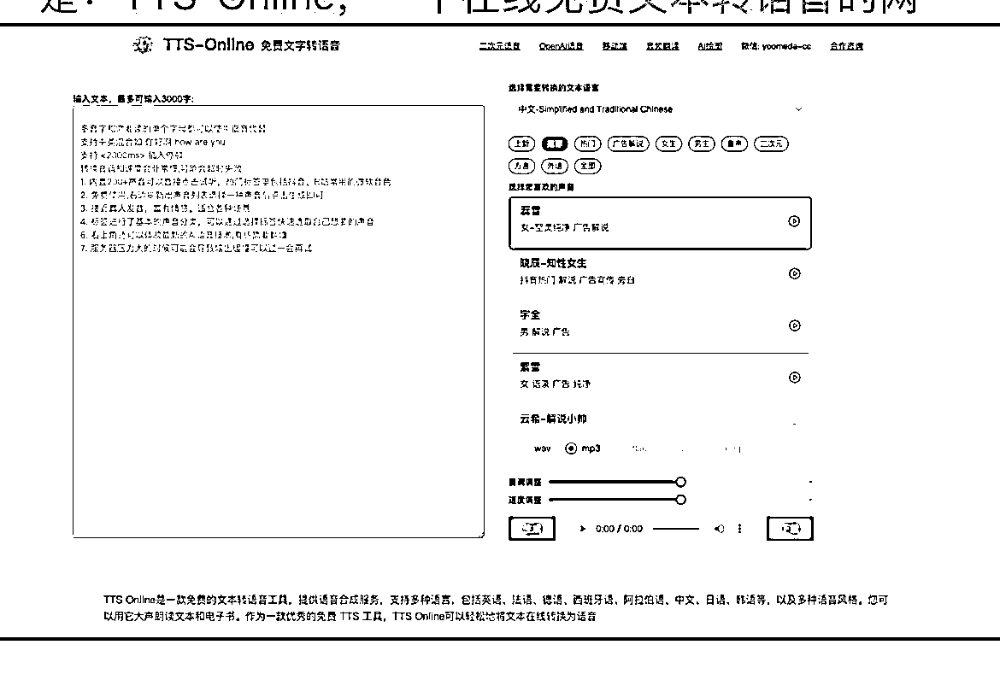
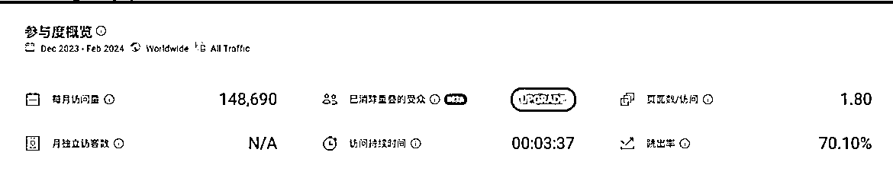

# TTS-Online：免费在线文本转语音网站，多种声音选择

> 原文：[`www.yuque.com/for_lazy/xkrm14/gdg7o9i1e8bumzcl`](https://www.yuque.com/for_lazy/xkrm14/gdg7o9i1e8bumzcl)

作者： 蛤蟆先生

日期：2024-03-22

点赞数：**109**

* * *

正文：

TTS-Online，一个在线免费文本转语音的网站，，每月 14.87 万访问量
网站支持将文本转换为各种不同的声音，包括女声、男声、童声、二次元、方言、外语等，功能十分强大，甚至支持游戏角色的声音；
也支持 OpenAI 的模型语音，输入文字部分，可以一键生成合成语音；
这个网站没有广告，也不需要付费就可以使用，目前没有盈利。不过在顶部导航有一些给其他产品导流的菜单，开发者也有可能想把这款产品作为一个引流产品，通过其他产品来变现；在线免费文本转语音

*   TTS-Online | 多种声音与二次元语音 )

* * *

评论区：

九 : openai 没有文本转语音模型吧

蛤蟆先生 : [`platform.openai.com/docs/models/tts`](https://platform.openai.com/docs/models/tts) 

苏富几 : 测试了一下，每日有 6000 字符的使用额度，超出额度还是需要会员的

* * *

公众号懒人搜索，懒人专属群分享