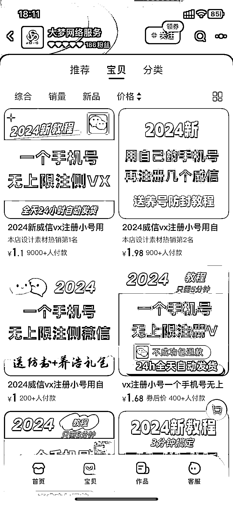

# 淘宝上一个垂直店铺，9 个宝贝售卖同一产品，销量数据强劲

> 原文：[`www.yuque.com/for_lazy/xkrm14/ggczs0oyra91gmk9`](https://www.yuque.com/for_lazy/xkrm14/ggczs0oyra91gmk9)

作者： 仙道不懒惰

日期：2024-03-21

点赞数：**54**

* * *

正文：

淘宝上发现一个非常垂直的店铺，一个店铺总共 12 个产品，其中 9 个宝贝都在售卖同一个产品，只是换了图片价格不同，每个宝贝都有销量，最多的 9000+，最少的也有大几十，普遍在几百，数据不错。

* * *

评论区：

* * *

公众号懒人搜索，懒人专属群分享