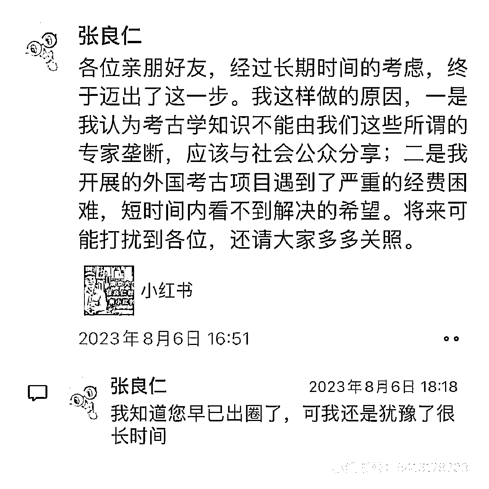

# 南大考古学教授的美食探店视频走红

> 原文：[`www.yuque.com/for_lazy/xkrm14/wdctanwzq6afms7q`](https://www.yuque.com/for_lazy/xkrm14/wdctanwzq6afms7q)

作者： 小吴姐

日期：2024-03-19

点赞数：**41**

* * *

正文：

南大考古学教授的探店视频窜红，1 个月涨粉百万 偶然刷到，南大考古学张良仁教授开的美食探店帐号，以“历史考古知识➕日常美食”
两个元素结合，以及教授身份加持，不仅涨粉，还直接得到 cctv 报道。 即便我们普通人没有教授身份加持，
“泛而广的文化知识➕日常生活场景”，这个公式应该也非常有用！

* * *

评论区：

白黑 : 今天刚看了刘仪伟采访他的纪录片

小吴姐 : 哇，太高兴了，竟然入选中标了！

* * *

公众号懒人搜索，懒人专属群分享