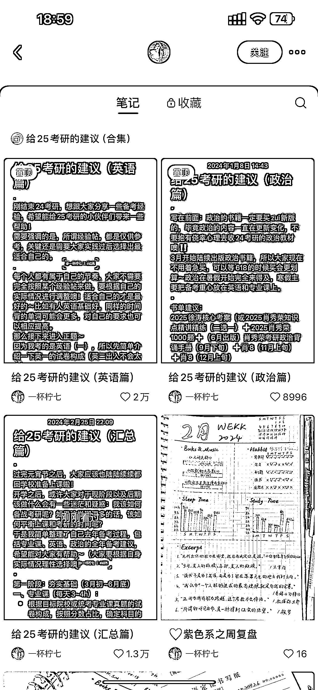

# 考研热度持续上升，教培行业有机会引流增流量

> 原文：[`www.yuque.com/for_lazy/xkrm14/vu4rmkwd2ukbmfvp`](https://www.yuque.com/for_lazy/xkrm14/vu4rmkwd2ukbmfvp)

作者： 刘娜

日期：2024-03-22

点赞数：**57**

* * *

正文：

最近考研国家线刚出，又是一个很大的热度，随着工作越来越难找的考研大军也越来越多，所以考研也越来越热了，这个博主就发了三篇这样的笔记都爆了，之前的笔记都是流量很少的素人，所以教培相关的可以借鉴一下，发相关笔记和引流，几个群都是爆满

* * *

评论区：

_17 : 赞！

速影 : 考研这赛道真是历久不衰

刘娜 : 最近这两年尤其火热，都到了要去找关系运作的程度了😂

速影 : 证明经济确实拉胯了[捂脸]

刘娜 : 对的，连带效应，找不到工作都来卷考研考公了[呲牙]

外夏 : 找关系运作怎么讲？

刘娜 : 有难度哈哈😂

* * *

公众号懒人搜索，懒人专属群分享