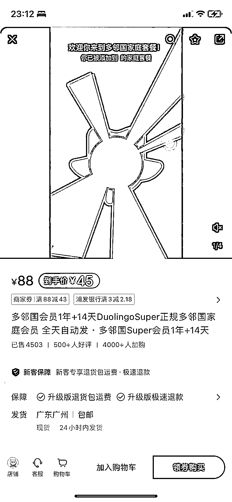
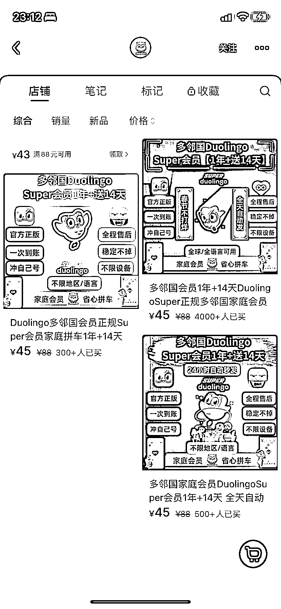
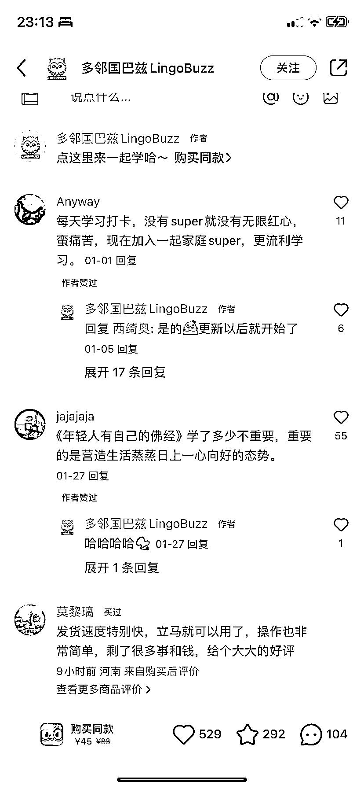
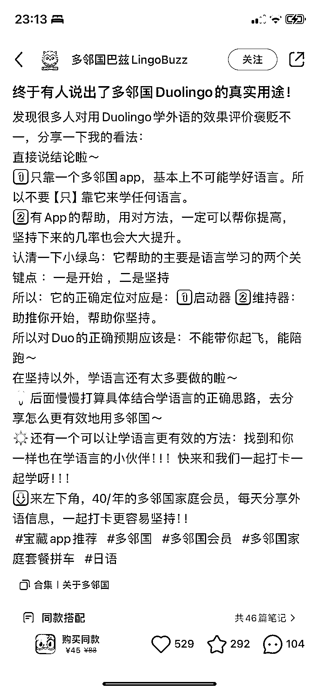
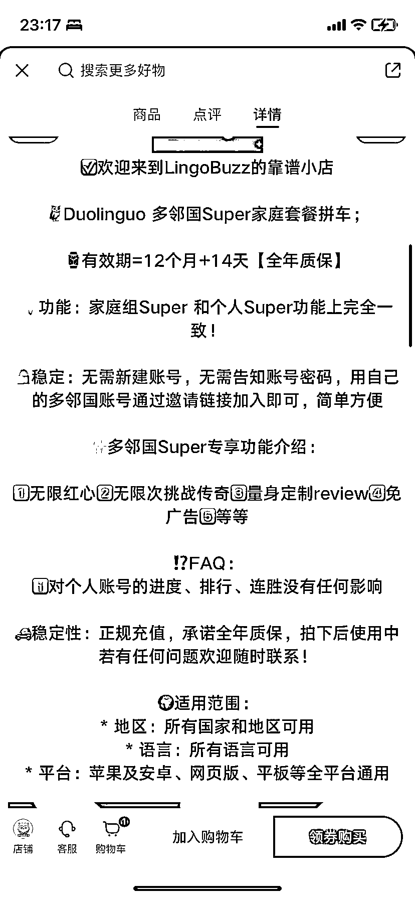

# 邻国会员拼车：销量 5000+，利润高达 200000

> 原文：[`www.yuque.com/for_lazy/xkrm14/csq87r12g9fot9rl`](https://www.yuque.com/for_lazy/xkrm14/csq87r12g9fot9rl)

作者： 铁柱

日期：2024-03-21

点赞数：**49**

* * *

正文：

邻国会员拼车做成了一个生意，店铺商品价格在 40 上下，销量已经有 5000 多，起码赚了 5000*40=200000。

* * *

评论区：

Hilooong : 扩展为所有热门的海外产品会员都可以尝试拼车

铁柱 : 是的[强]

王球球 : 哈哈 看了这条帖去拼了个会员

陈陈陈 : 我看官网家庭版 6 个人的成员一年也要 780，折合到一个人也是 130，为啥他能做到 45 一个人每年

铁柱 : 我也比较好奇她是怎么做到这么低的价格，但是我认为在自己没有货源的时候可以做无货源搬运

唯一 : 我也很好奇这个

紀子 : 我就买了😳

徐铭悦 : 闲鱼 25 差价出来了

* * *

公众号懒人搜索，懒人专属群分享