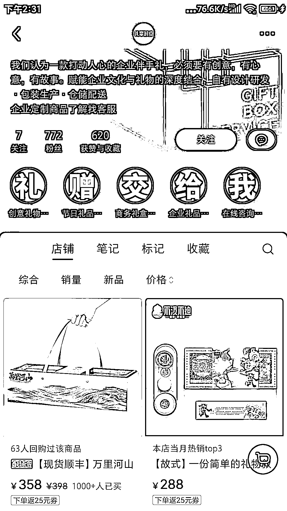
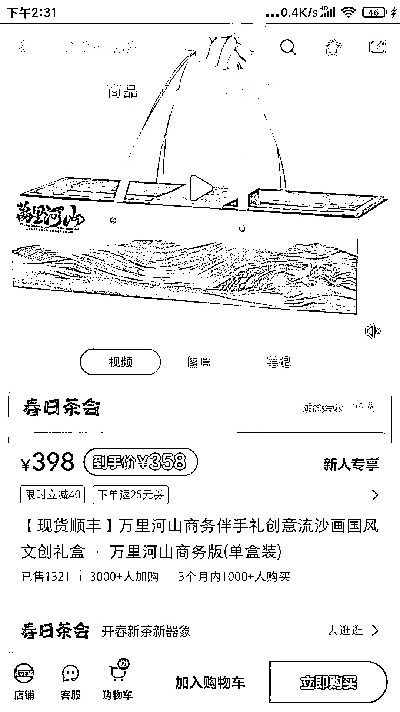
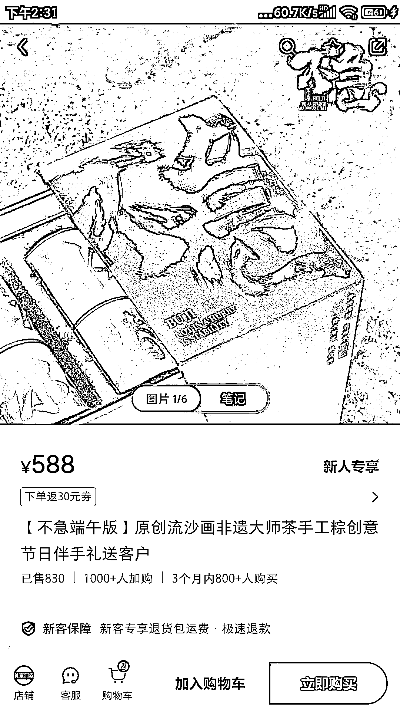

# 小红书上销量高达 100w+的商务伴手礼小众细分赛道

> 原文：[`www.yuque.com/for_lazy/xkrm14/ifgdu6ccvhixb4c4`](https://www.yuque.com/for_lazy/xkrm14/ifgdu6ccvhixb4c4)

作者： hedy

日期：2024-03-29

点赞数：**64**

* * *

正文：

商务伴手礼小众细分赛道，772 个粉丝，在小红书销量营收高达 100w+
主要卖商务国风流沙礼盒，这种同时结合文创和商务伴手礼的爆品，客单价不低，平均 358-588 不等，销量 800-1000。
看了下账号是去年 3 月开始更新的，笔记数据很一般，最高才 30 赞。竞争不是很激烈，值得冲

* * *

评论区：

念一的创业无限游戏 : 旗舰店，

念一的创业无限游戏 : 利润蛮高，

程序喵 : 谢谢分享，这个礼盒制作设计开模后可能需要压货？成本是不是较高？

* * *

公众号懒人搜索，懒人专属群分享