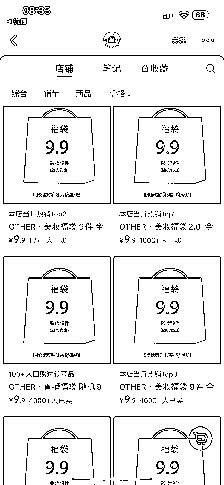
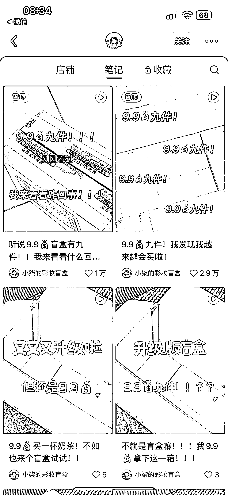
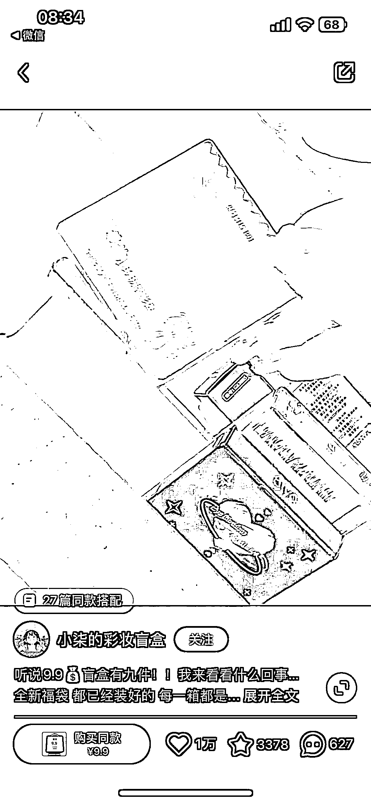
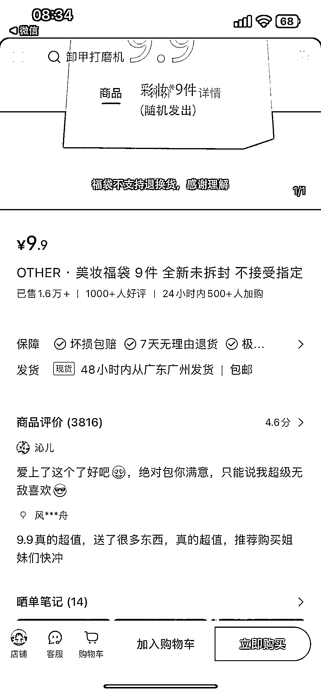
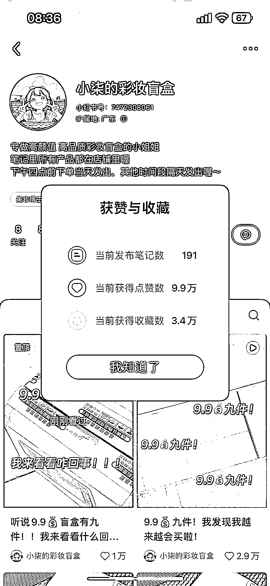

# 小红书彩妆盲盒：数据和销量双双亮眼，探索更多产品可能性

> 原文：[`www.yuque.com/for_lazy/xkrm14/oegbvqdvuio3fi1i`](https://www.yuque.com/for_lazy/xkrm14/oegbvqdvuio3fi1i)

作者： 天涯

日期：2024-03-29

点赞数：**45**

* * *

正文：

小红书彩妆盲盒，笔记数据和销量都很不错，博主是从去年七月开始发，一百多篇笔记，笔记制作难度不大，店铺好评反馈也很多，有种拆盲盒的乐趣，复购率高。除了彩妆，是不是可以延伸到其他的产品上，比如零食盲盒等。

* * *

评论区：

小查 Charles : 她是自己装货发货吗？还是有供应商？

天涯 : 我找了 1688 没看到有货源，应该是自己批量采购，再发

* * *

公众号懒人搜索，懒人专属群分享