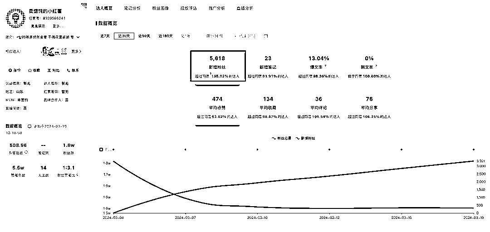

# 小红书馄饨店：2 个月闭环，100W+ GMV，创业打印爆单揭秘

> 原文：[`www.yuque.com/for_lazy/xkrm14/xi4w1w2lc90093w3`](https://www.yuque.com/for_lazy/xkrm14/xi4w1w2lc90093w3)

作者： HarrySun

日期：2024-03-25

点赞数：**36**

* * *

正文：

小红书卖馄饨，2 个月闭环，100W+ GMV 形式：视频+图文 内容：馄炖店老板记录+创业打印爆单+开店日常 来源：江河

* * *

评论区：

唐瑞 : 这个原帖在哪里啊

子酿 : 山东潍坊的，小红书开了 4-5 个号同时在卖馄饨

HarrySun : 这个哈 [`www.toutiao.com/article/734850459223539768...`](https://www.toutiao.com/article/7348504592235397682) 

HarrySun : [强][强]

姚永刚 : [发呆]像饺子店这些的岂不是也可以额搞起来。

姚永刚 : 刚看了一下，产品，好像已经在下架中了。

* * *

公众号懒人搜索，懒人专属群分享