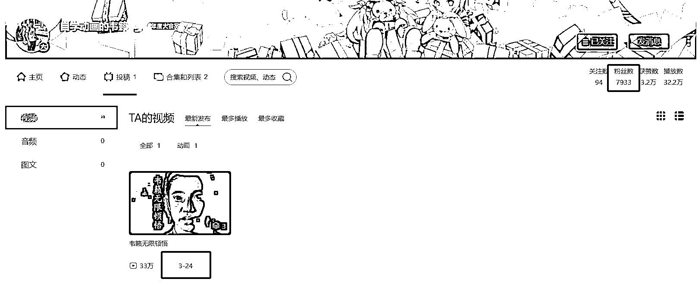
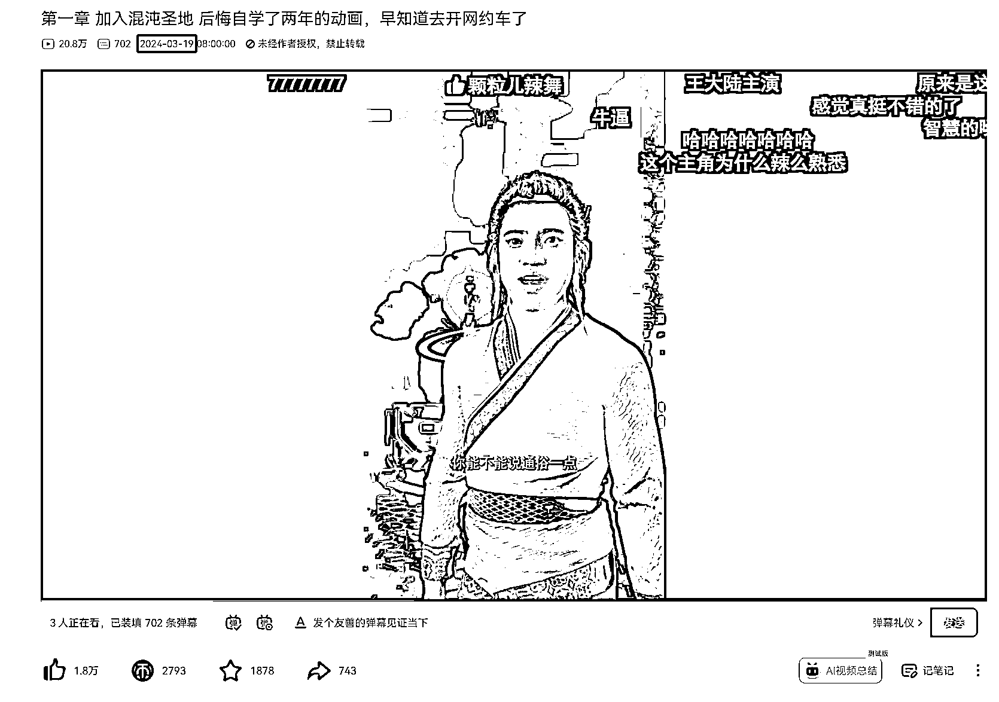

# 3D 动画制作小说剧集，10 天涨粉近 8k，AI 工具制作微短剧

> 原文：[`www.yuque.com/for_lazy/xkrm14/sp6ktippx2yw1iq2`](https://www.yuque.com/for_lazy/xkrm14/sp6ktippx2yw1iq2)

作者： Bernie Fu

日期：2024-03-29

点赞数：**48**

* * *

正文：

3d 动画制作小说剧集，10 天发布 3 条视频涨粉近 8k，发散一下可以用 chatgpt 写短剧爽文剧本，然后用 AI 视频工具制作简短视频，做成微短剧付费形式，低成本变现空间很大。

* * *

评论区：

wanted（式钦） : 有什么 ai 视频工具推荐吗

* * *

公众号懒人搜索，懒人专属群分享