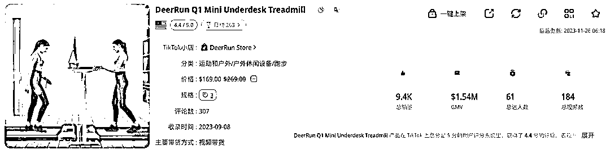
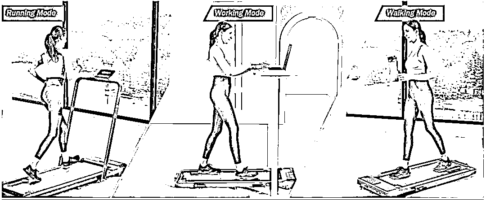
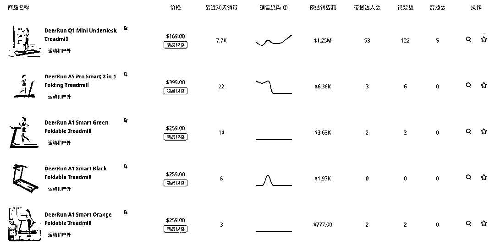

# TikTok 上居家健身器材销量飙升，迷你桌下跑步机成热门商品

> 原文：[`www.yuque.com/for_lazy/xkrm14/que15yszhepdnnmf`](https://www.yuque.com/for_lazy/xkrm14/que15yszhepdnnmf)

作者： 斑马森林

日期：2024-03-29

点赞数：**57**

* * *

正文：

近期运动健身在 TikTok 上刮起一阵热风。许多达人在平台分享自己的健身日常，也有很多用户立下 2024 年的自律和减肥的“flag"。由此需求衍生出运动相关的产品在 TikTok
Shop 上热销。 一些体积小、易收纳的居家健身器材在 TikTok
shop 的销量火速飙升，且入局的卖家较少，正处于蓝海市场。美国本土小品牌店 DeerRun 凭借明星产品桌下迷你跑步机，从 11 月 1 日入驻 TikTok
Shop 截至 11 月 26 日，预估 GMV 超过 106 万美元。 小店主要商品为迷你桌下跑步机。商品价格分布在 169 美元到 399 美元之间，平均商品价格近 251 美元。
DeerRun 品牌的主要受众为有健身需求的女性。该店的明星产品为居家桌下折叠跑步机。这件商品可以满足居家锻炼的多种场景:
在常规的跑步模式的基础上，它还添加了慢走模式。
除此之外，还有工作模式:它可以被放置在升降办公桌或站立办公桌下，人们可以一边办公，一边在跑步机上走动，达到避免长时间久坐和轻度锻炼的目的。
除了功能创新之外它比传统的跑步机更加轻便，占地面积小，容易收纳。在不使用的时候可以折叠起来放入沙发底下或靠墙放置，能够适配小户型房子。

* * *

评论区：

爽子 : 怪不得前天面试 tk 直播带货，他们在卖瑜伽垫

* * *

公众号懒人搜索，懒人专属群分享