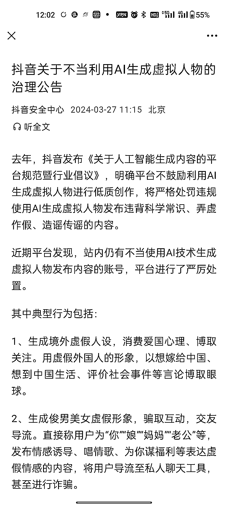
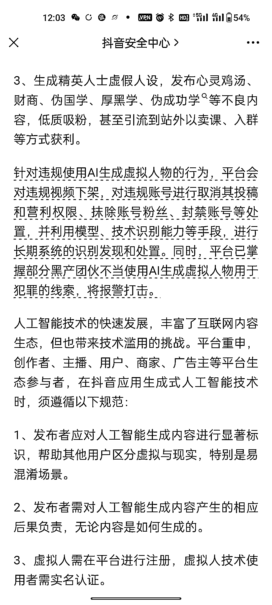
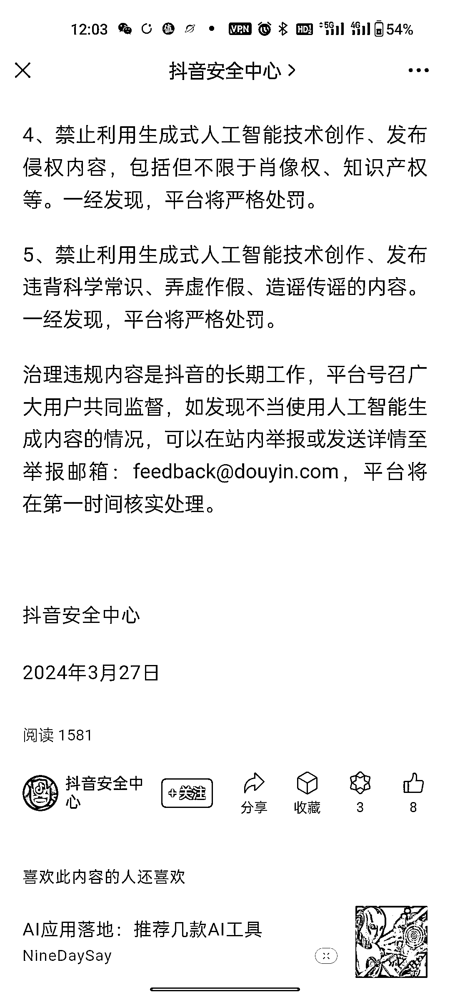

# 抖音发布新政：限制虚拟人物的不当利用，要求实名认证

> 原文：[`www.yuque.com/for_lazy/xkrm14/pohnrc5nf3wg2agn`](https://www.yuque.com/for_lazy/xkrm14/pohnrc5nf3wg2agn)

作者： 半藏

日期：2024-03-27

点赞数：**35**

* * *

正文：

【抖音新政】抖音关于不当利用 AI 生成虚拟人物的治理公告：生成虚假形象，骗取互动、交友导流，肯定要限流了。虚拟人需在平台注册，虚拟人技术使用者需实名认证，越来越严格

* * *

评论区：

* * *

公众号懒人搜索，懒人专属群分享