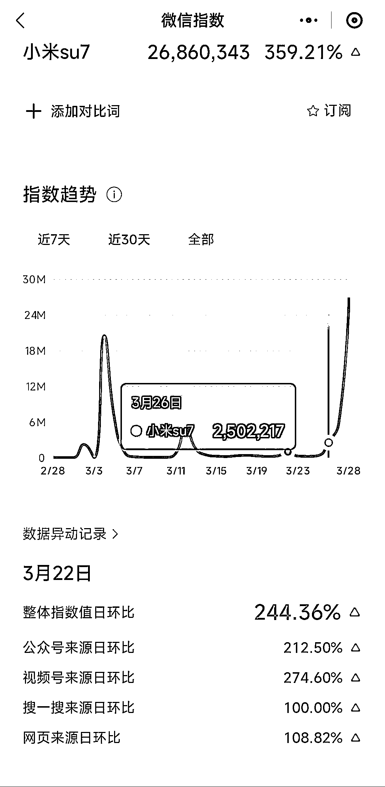
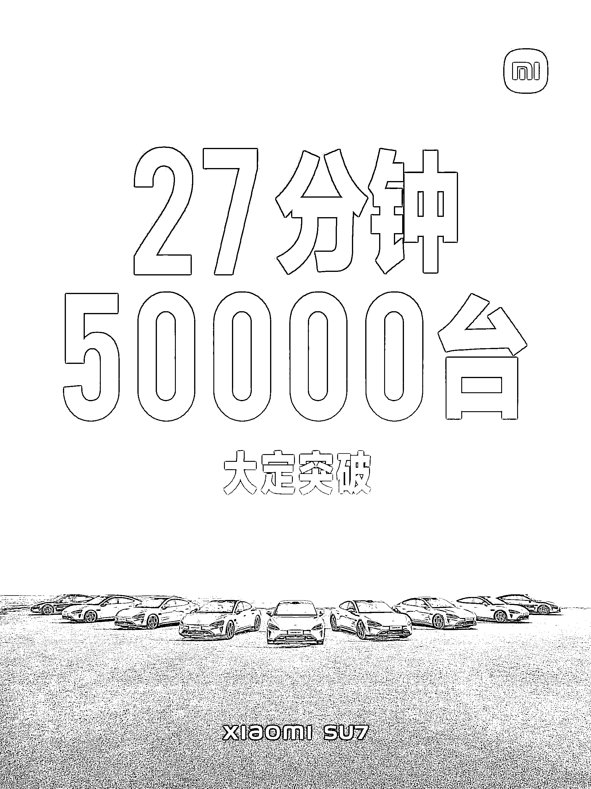

# 小米 su7 突破 50000，车品卖家需关注汽车周边需求旺盛

> 原文：[`www.yuque.com/for_lazy/xkrm14/za0a50rslr7bd2m0`](https://www.yuque.com/for_lazy/xkrm14/za0a50rslr7bd2m0)

作者： 汪老师

日期：2024-03-29

点赞数：**58**

* * *

正文：

小米 su7 大定 27 分钟突破 50000，这几天相关关键词的搜索量一路狂飙，车品卖家可要关注着，如果实际买车交付量确实很大，汽车周边需求会很旺。

* * *

评论区：

钱钰 : 手机厂就喜欢做配件生意

汪老师 : 价格这波造悬念就很会营销

* * *

公众号懒人搜索，懒人专属群分享