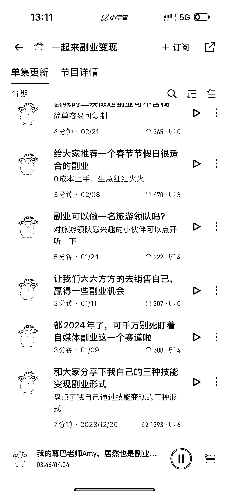
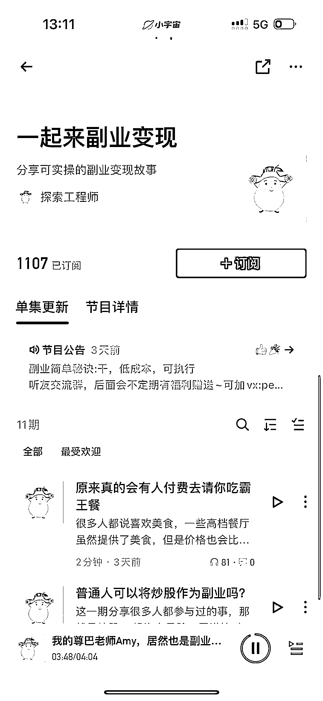

# 副业项目分享，简单易学，零成本，高付费能力

> 原文：[`www.yuque.com/for_lazy/xkrm14/byl70hui3q4qsk3g`](https://www.yuque.com/for_lazy/xkrm14/byl70hui3q4qsk3g)

作者： Vivi|每日成长 *

日期：2024-03-25

点赞数：**60**

* * *

正文：

去掉个人 IP 属性，专门讲知道、遇到的副业项目，每期节目时间都很短，五分钟左右，做起来也没什么压力。甚至星球里的风向标，都可以进行拆解。
引流加微信，入读者群。后期可以交流卖社群，或是生财的搞钱社群。 成本零，制作简单，大家可以上手一试。小宇宙的人群付费能力也比较高。

* * *

评论区：

一网 : 他这个是什么平台呢？

李幸运 : 一个专门做播客的 APP，叫“小宇宙”

Vivi|每日成长 * : 小宇宙

一网 : 感谢

一网 : 感谢

* * *

公众号懒人搜索，懒人专属群分享