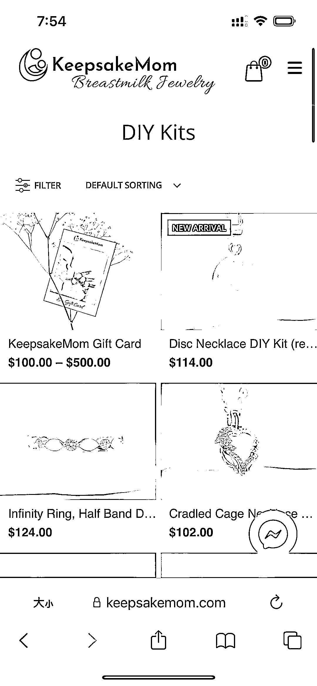
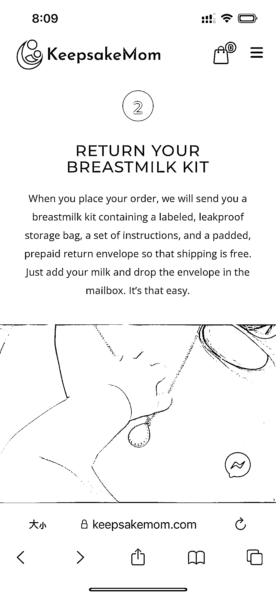

# 用母乳和胎发制作的母婴纪念品，成本低却能卖到高价

> 原文：[`www.yuque.com/for_lazy/xkrm14/nxnxpksgxa1839qg`](https://www.yuque.com/for_lazy/xkrm14/nxnxpksgxa1839qg)

作者： amanda_win*

日期：2024-03-26

点赞数：**62**

* * *

正文：

卖母婴纪念品，用宝妈在哺育宝宝时留下的母乳和胎发做成配饰，可以是项链、戒指等等。成本很低，但是却能卖到均价 100 多美金。商品本身就不仅仅是装饰品了，是想留住的珍贵回忆。有没有什么产品是成本低又能卖高价的？那就是情感触动赛道，典型的如母婴纪念品和宠物纪念品。这也是适合跨境小白的项目，这种饰品品类适合低成本启动，而且有高溢价的空间。

* * *

评论区：

姚永刚 : 母乳和胎发怎么做成的饰品的？这个很好奇，以前看到生财里有分享过把胎发做成毛笔的。

* * *

公众号懒人搜索，懒人专属群分享