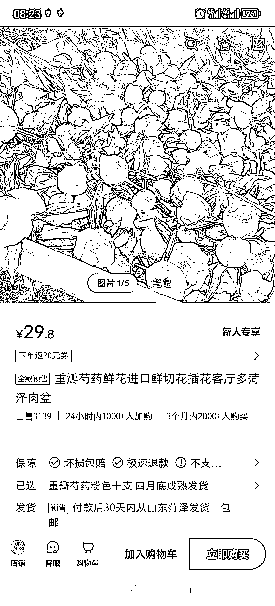
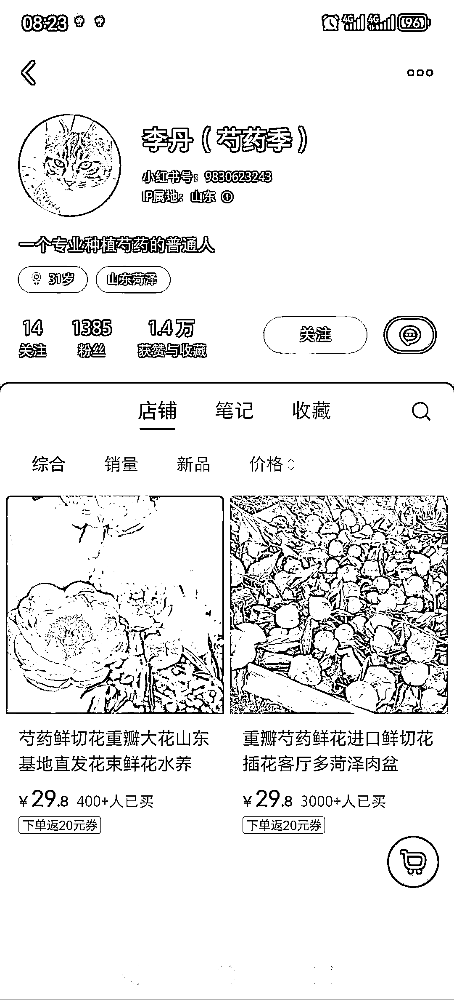
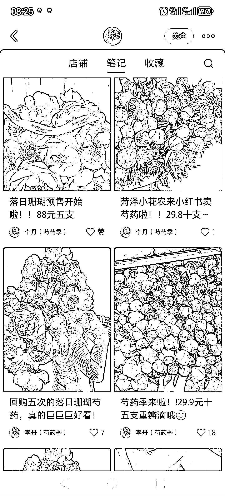
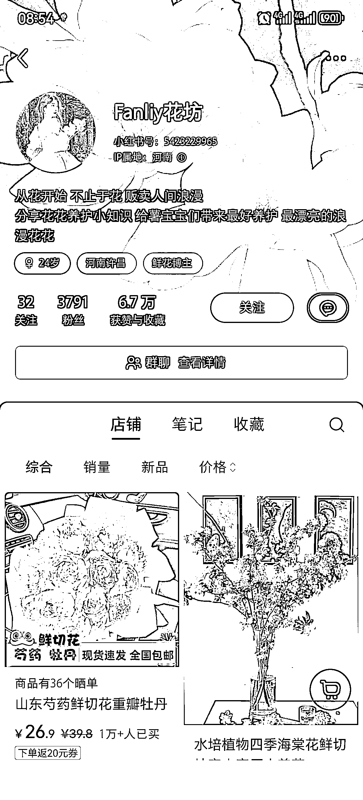
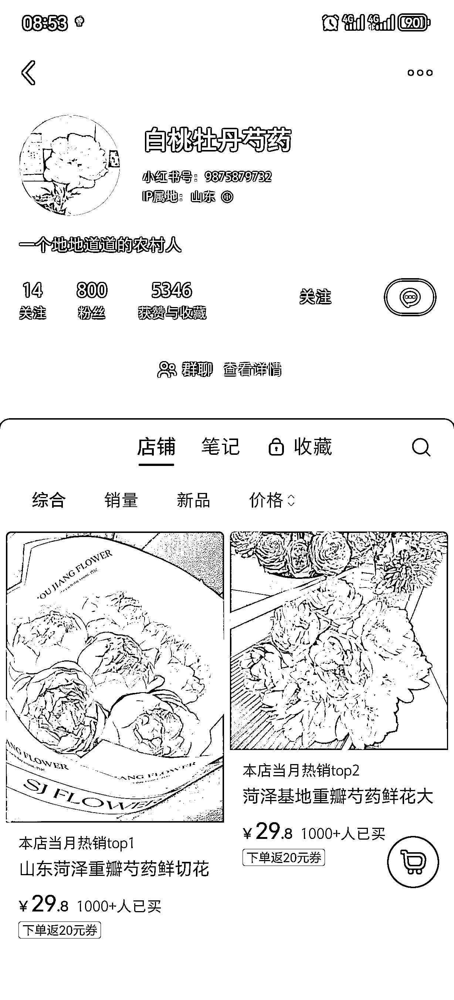
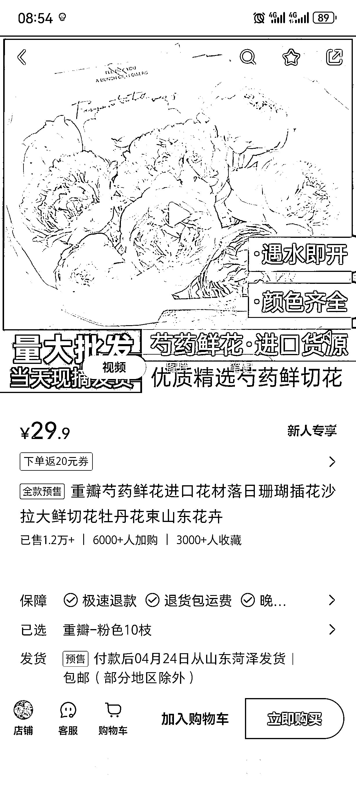
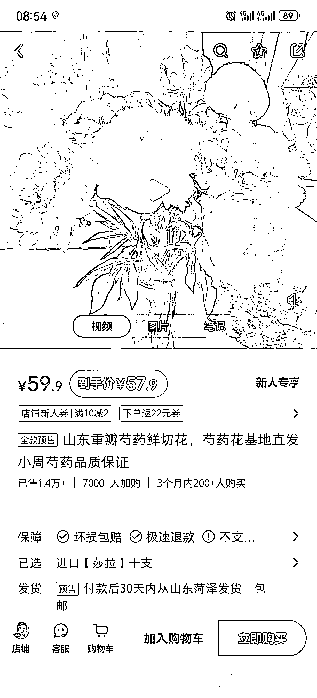

# 低粉账号卖鲜切花

> 原文：[`www.yuque.com/for_lazy/xkrm14/gyo7puiagrsu8ysq`](https://www.yuque.com/for_lazy/xkrm14/gyo7puiagrsu8ysq)

作者： 半阙酒

日期：2024-03-29

点赞数：**38**

* * *

正文：

多账号低粉爆款卖鲜切花 这个博主才 1385 个粉丝，发笔记卖重瓣芍药牡丹花预售，笔记简单但是看的很让人有购买欲望。
定价 29.8-168，5 至 10 枝，从普通款到进口款 四月是牡丹开始盛开的季节，现在才 3 月，四月底才发售，已经售出三千多单，对比拼夕夕利润多了三分之一吧
小红书平台，对于这类应急鲜切花的售卖也是个不错的，并且复合小红书用户格调，有资源可以提前布局 目前小红书已经看到多个账号低粉卖出 1W+了，粉丝都只有几千
感觉这个项目也适合多账号矩阵布局

* * *

评论区：

* * *

公众号懒人搜索，懒人专属群分享