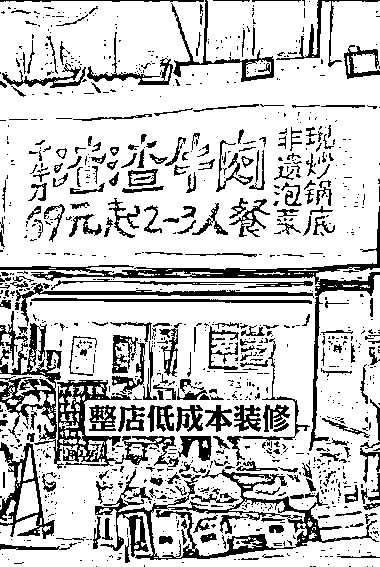
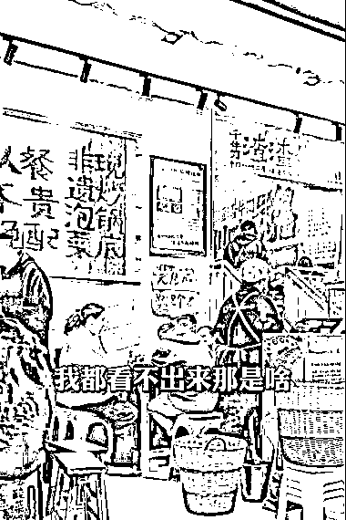
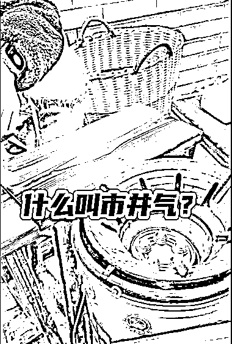
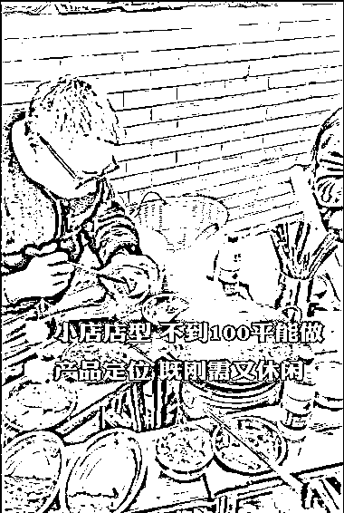
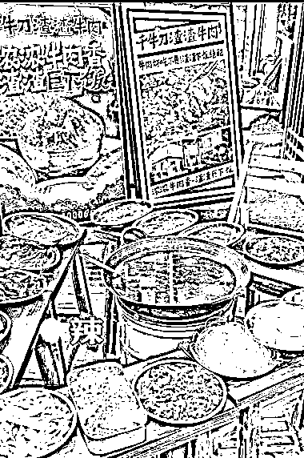

# 低成本装修，火爆成都的市井小店

> 原文：[`www.yuque.com/for_lazy/xkrm14/ktn7tkr6vqsd59ce`](https://www.yuque.com/for_lazy/xkrm14/ktn7tkr6vqsd59ce)

作者： 启点

日期：2024-03-25

点赞数：**37**

* * *

正文：

低成本装修，短期迅速火爆成都的市井小店
新开业不久的小店，大概也就三四个月，时常排队需要等一两个小时，据店员说每天销售额 20000+，视频中介绍的是成都店，查了下在北京新开的店也冲上了该区域的第一。
餐饮先看装修投资，店面不大，也就不到一百平，布置极其简单，廉价的 KT 板以及还有纸箱板，配上随手写的字体风格，联想到了近期小红书比较火的封面，也是随意手写文字，就是类似的风格。
还有桌椅布置，几张板凳一拼，火锅中间一放就是围炉，几乎跟就地露营差不多，主打的就是随性和接地气。点餐性价比也很高，69 元的 2~3 人餐，牛肉锅配大米饭，既有休闲的气息，也能满足吃饱的刚需。
总的来说这种小店模式可以适应很多环境，整店低成本装修，可大可小；产品主打非遗泡菜，酸辣口味，有卖点，性价比高，符合大众；据说也是四川的传统做法，将有一定认知的老产品，用新的方法重做一遍，再加些微创新，就有可能刷新认知，从而打爆市场。

* * *

评论区：

轮子 : 这个店是加盟连锁的吗？圈友

启点 : 这个不太清楚，我估计是，成都和北京都有

轮子 : 谢谢

启点 : 客气了[微笑]

请叫我 7 号 : 是的 他这个是加盟的 现在海底捞的团队也在打造这种小店，就是模式一样，但是团队不一样

请叫我 7 号 : 吸金小项目城市饱和度大概 2 年，主要就是收割加盟费，单店在 7 万

* * *

公众号懒人搜索，懒人专属群分享