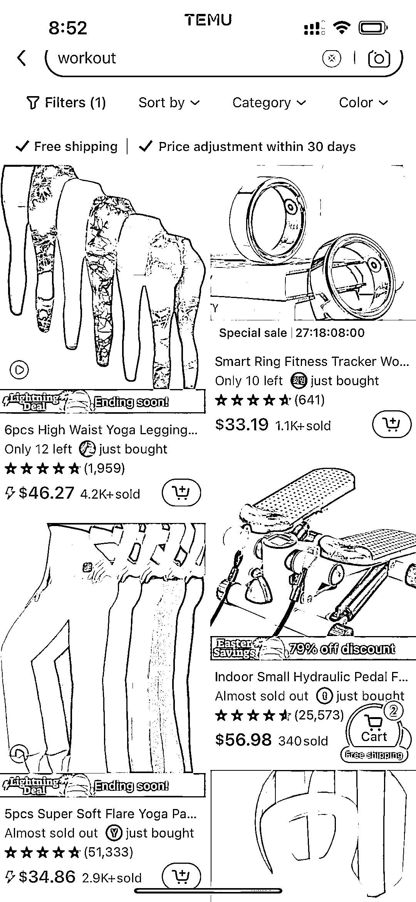

# Temu：一个寻找蓝海产品的优质选品平台

> 原文：[`www.yuque.com/for_lazy/xkrm14/dinkv994v2u1v448`](https://www.yuque.com/for_lazy/xkrm14/dinkv994v2u1v448)

作者： amanda_win*

日期：2024-03-27

点赞数：**69**

* * *

正文：

发现了一个很好的选品平台，那就是 Temu。如果你有自己了解的商品类目，在 Temu 上你会很快甄别出哪些产品可能只赚几块钱，哪些产品价格还不错。而这些价格还不错的产品就是可以开发的所谓蓝海产品。Temu 作为一个价格很敏感的平台，有产品还能卖到不错的价格而且销量还可以，除了一些大品牌，那么只能说这类产品有需求商家少，或者商家用了怎样的搭配提高溢价，这里面就有机会。特别是 Temu 现在入驻门槛低，大批的卖家涌入，要么低价要么产品小众才有机会脱颖而出，那么相当于大批的人帮你在试品，大浪淘沙。

* * *

评论区：

* * *

公众号懒人搜索，懒人专属群分享