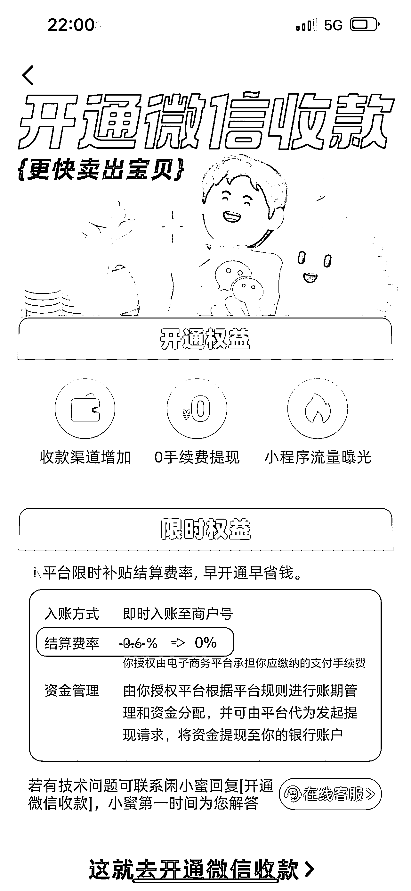
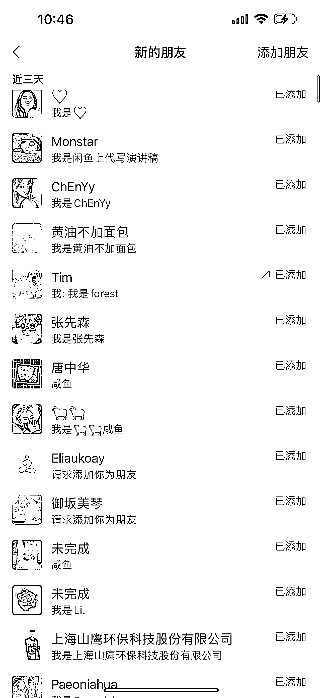
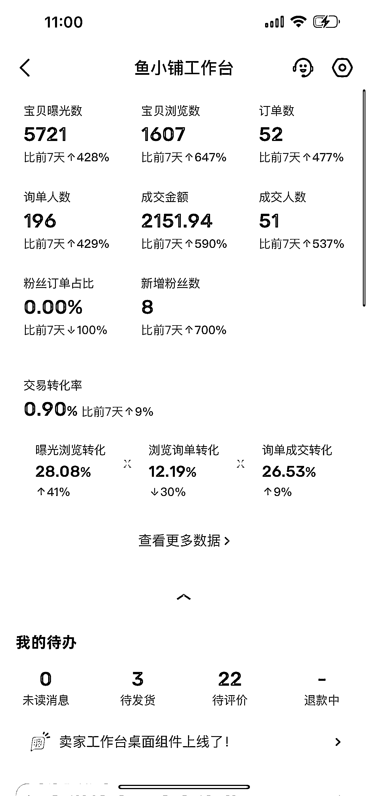
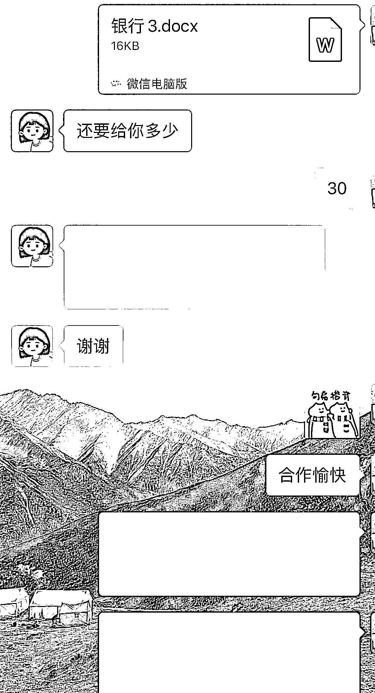

# 闲鱼开通微信收款，引流路径缩短，7 天引流 170 人，转化率可观

> 原文：[`www.yuque.com/for_lazy/xkrm14/ibn5io3gh6qitryu`](https://www.yuque.com/for_lazy/xkrm14/ibn5io3gh6qitryu)

作者： forest

日期：2024-03-29

点赞数：**63**

* * *

正文：

闲鱼开通微信收款了，引流路径进一步缩短，这几天尝试了发了几个 ai 代写的帖子，询单人数很多，测试了一下微信单号 7 天引流了 170 人，转化率也很可观，除了走闲鱼正常支付的，大部分都直接完成了微信成交，后期可以走矩阵，持续引流，自己找写手，完成发单转化即可。感兴趣的圈友可以试试。

* * *

评论区：

大鱼一梦趁风起 : 已经开通

本自具足 : 是不是只有开通鱼小铺，才能开通微信收款呢

张翼 : 流量为什么这么好呢我每天就几个流量[捂脸]

forest : 这个不确定，好像实名认证的均可以

forest : 哈哈哈多优化一下内容质量，复盘一下。

本自具足 : 蟹蟹 已开通哈

万简 : 代写客单价多少

forest : 看文章难易程度和消耗时间二位数到四位数不等。

* * *

公众号懒人搜索，懒人专属群分享