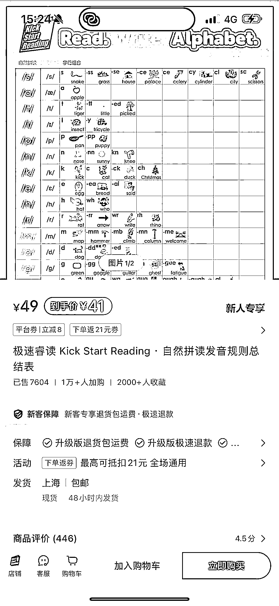
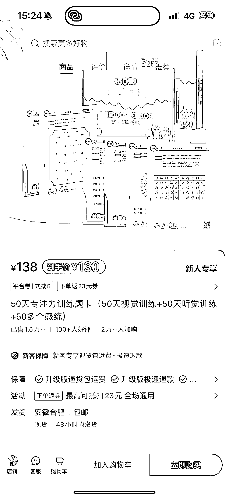
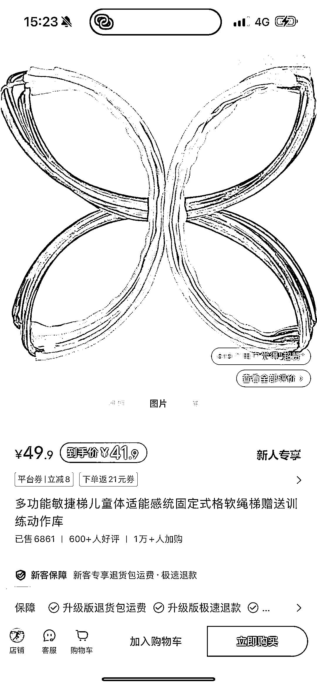

# 小红书成为畅销家庭教具的热门推广平台

> 原文：[`www.yuque.com/for_lazy/xkrm14/muw8qdbinlnu8eeq`](https://www.yuque.com/for_lazy/xkrm14/muw8qdbinlnu8eeq)

作者： 阿漫

日期：2024-03-28

点赞数：**96**

* * *

正文：

面向幼儿教育的家庭教具，自然拼读，感统训练以及专注力训练教具，销量稳定居高，小红书是个推广的好平台，年轻妈妈群体居多，结合好的内容输出，有不错的销售表现

* * *

评论区：

申姐全域营销 : 这个不错

3113 大吉大利 : 是

小小 : 这几个品挑选的也好

* * *

公众号懒人搜索，懒人专属群分享