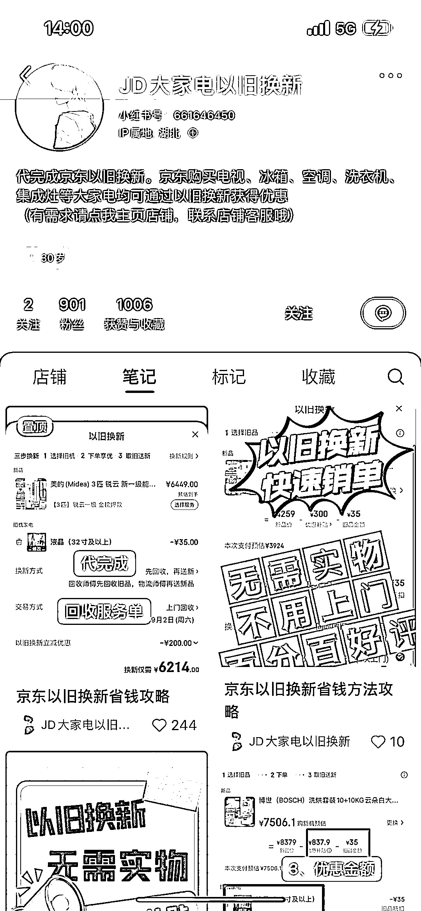
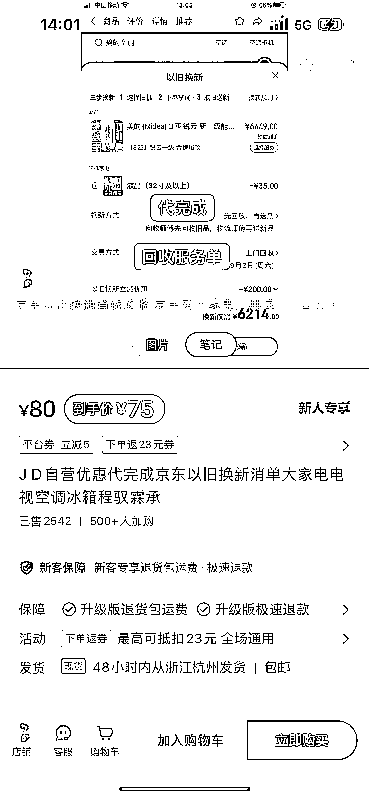

# 小红书低粉高销，代完成京东大家电回收单，利润高达 8 万 8

> 原文：[`www.yuque.com/for_lazy/xkrm14/br5lsn969lciz1h0`](https://www.yuque.com/for_lazy/xkrm14/br5lsn969lciz1h0)

作者： 真实姓名

日期：2024-03-29

点赞数：**47**

* * *

正文：

小红书低粉高销，代完成京东大家电回收单 假设一单回收商要出 35 的成本，售价 75，利润 40。900 粉丝，销量 2500，复购率应该挺高，就已经变现 8 万 8。
薅羊毛逻辑：京东以旧换新会给顾客优惠券，顾客 75 元下单回收单，可以拿到 200 元优惠券节省一百多。

* * *

评论区：

深圳老刘 : 很好奇，他们怎么销单的。

* * *

公众号懒人搜索，懒人专属群分享