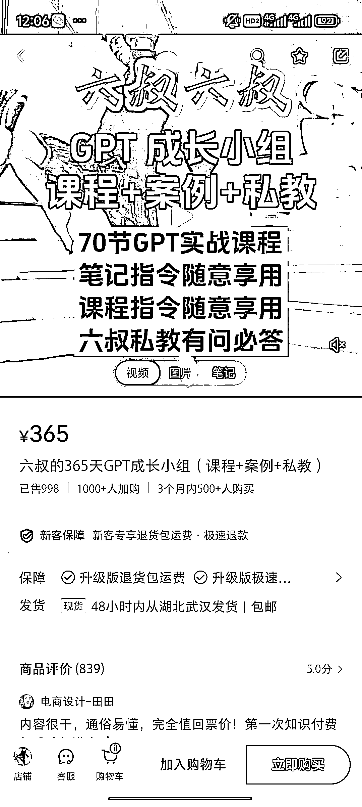
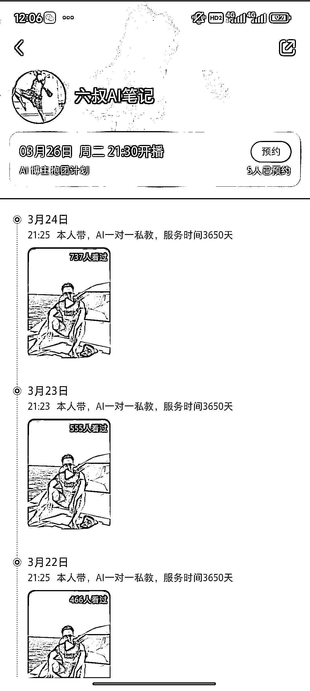
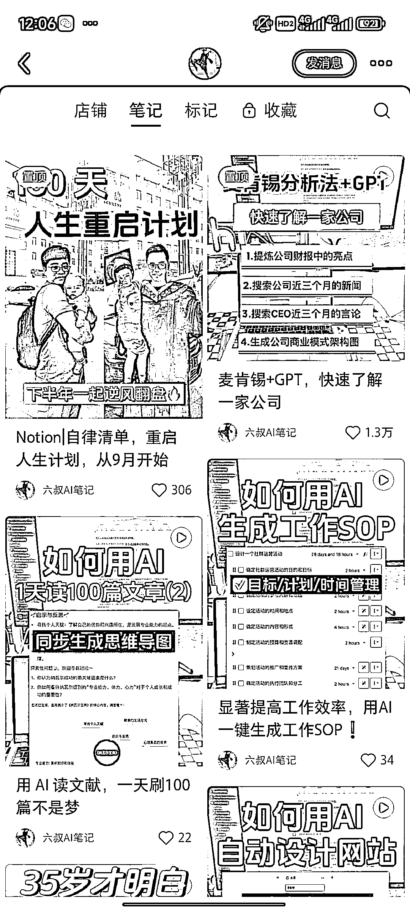

# 小红书教你如何使用 GPT，变现能力强，收入超过三十六万

> 原文：[`www.yuque.com/for_lazy/xkrm14/lmgfzvwup88f2une`](https://www.yuque.com/for_lazy/xkrm14/lmgfzvwup88f2une)

作者： 万能的星星 i

日期：2024-03-25

点赞数：**44**

* * *

正文：

在小红书教怎么使用 GPT ，笔记内容聚焦 ai 在日常中的用法，几乎每天都直播。365 元的课程卖了 1000
份，365*1000=365000，变现能力很强。盲猜私域应该还有更高客单价的产品，实际收入应该远超三十六万。

* * *

评论区：

申姐全域营销 : 不错

淡月清云 : 服务时间 10 年好离谱

6Young : 涉及教用梯子么 警惕

万能的星星 i : 这个不太清楚诶

叶许🍀 : 年前就有看到他在播，

姚永刚 : 知识变现类产品，生财学习以后，做出来课件，然后在小红书、视频号、抖音等流量平台进行售卖 交付：视频课程+小客户持续恢复
说是十年交付，绝对不可能，但是十年就给别人一种超值的感觉

* * *

公众号懒人搜索，懒人专属群分享