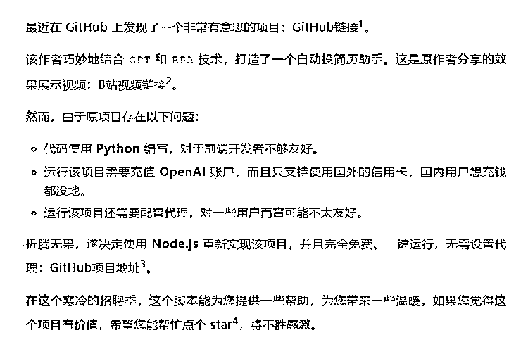

# GPT 自动投简历工具，一周斩获三个 offer，开源分享！

> 原文：[`www.yuque.com/for_lazy/xkrm14/znbrdoqrbt90tkee`](https://www.yuque.com/for_lazy/xkrm14/znbrdoqrbt90tkee)

作者： Strawberry

日期：2024-03-29

点赞数：**70**

* * *

正文：

GPT 自动投简历，一周斩获三 offer，开源分享！ 现在找工作很难，如果可以利用工具，帮别人找到匹配的工作，大概是有价值的一件事。 参考资料：
[1]GitHub 链接: [2]B 站视频链接: [3]GitHub 项目地址:[GitHub -
Frrrrrrrrank/auto_job**find**chatgpt__rpa...](https://github.com/Frrrrrrrrank/auto_job__find__chatgpt__rpa) [赛博投简历脚本教程*哔哩哔哩*bilibili](https://www.bilibili.com/video/BV1UC4y1N78v/?share_source=copy_web&vd_source=b2608434484091fcc64d4eb85233122d) GitHub

*   noBaldAaa/find-job: 自动投简历助手，一键运行，完全免费 
    job)

* * *

评论区：

Strawberry : 实现思路：[GPT 自动投简历，一周斩获三 offer，开源分享！](https://mp.weixin.qq.com/s/XtQHNZFuNuYjRWBSsMLYjg) 

Strawberry : 感谢亦仁大佬 🙏 第一次发风向标就被看见了！[耶]

姚永刚 : [发呆]厉害的 GPT

* * *

公众号懒人搜索，懒人专属群分享