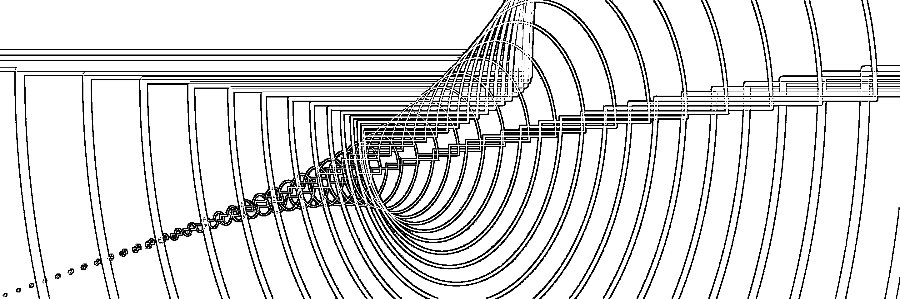
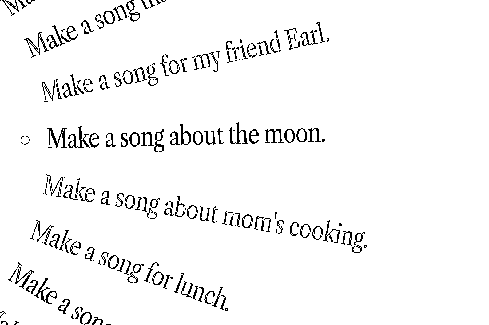

# Suno v3：创新模型让你轻松实现音乐梦想

> 原文：[`www.yuque.com/for_lazy/xkrm14/rvzruipkhi16a9cs`](https://www.yuque.com/for_lazy/xkrm14/rvzruipkhi16a9cs)

作者： 涵哥

日期：2024-03-25

点赞数：**36**

* * *

正文：

Suno v3 是全球首款能够生成广播级音质歌曲的创新模型。
输入一段歌词，选择一个你钟爱的音乐风格，几秒之后即可获得一首两分钟长的完整歌曲，且完全免费。是的，就是这么直接，这么简单。
忘掉以往那些复杂的音乐制作流程，你不需要是音乐大师，也不需要精通任何乐器，你只需要有想法。 在开放创作的同时，Suno 也也非常重视作品的原创性和用户的安全。
为此，Suno 独家开发了一种无法听见的水印技术，这项技术可以有效识别歌曲是否由 Suno 创作，防止滥用和侵权行为，确保每一位创作者的劳动成果得到尊重。
Suno v3 的出现，让音乐创作不再是专业人士的专利。 无论你是洗澡时的哼唱者，还是梦想登上音乐排行榜的艺术家，Suno
v3 都能帮你跨过技术的门槛，轻松实现音乐梦想。 从此，你的每一个念头，都有可能变成耳边的旋律。 Suno
v3 的发布，被视为该公司的“GPT-4 时刻”，但 Suno 团队并没有满足于此。
他们已经开始研发 v4 版本，并承诺将在未来的版本中进一步提升音乐的质量、控制度和创作速度。
这意味着，随着 Suno 的不断进步，我们将拥有更多创作和分享音乐的可能。 免费体验入口： [Suno AI](https://www.suno.ai)

* * *

评论区：

* * *

公众号懒人搜索，懒人专属群分享