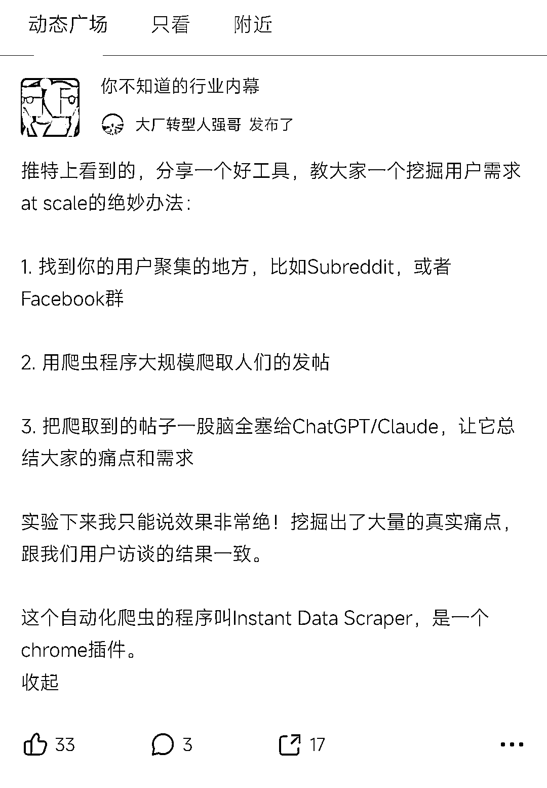

# 使用 Instant Data Scraper 揭示用户需求的绝妙办法

> 原文：[`www.yuque.com/for_lazy/xkrm14/elvx8mgb668zheeg`](https://www.yuque.com/for_lazy/xkrm14/elvx8mgb668zheeg)

作者： Ante

日期：2024-03-26

点赞数：**108**

* * *

正文：

【即刻上看到这个挖掘需求的帖子】 分享一个好工具，教大家一个挖掘用户需求 at scale 的绝妙办法： 1.
找到你的用户聚集的地方，比如 Subreddit，或者 Facebook 群 2\. 用爬虫程序大规模爬取人们的发帖 3.
把爬取到的帖子一股脑全塞给 ChatGPT/Claude，让它总结大家的痛点和需求
实验下来我只能说效果非常绝！挖掘出了大量的真实痛点，跟我们用户访谈的结果一致。 这个自动化爬虫的程序叫 Instant Data
Scraper，是一个 chrome 插件。

* * *

评论区：

广州摄影师林海盐 : 这个具体是怎么操作呢？

Ante : 谢谢亦人大大[嘿哈]

宁也 : 6

* * *

公众号懒人搜索，懒人专属群分享