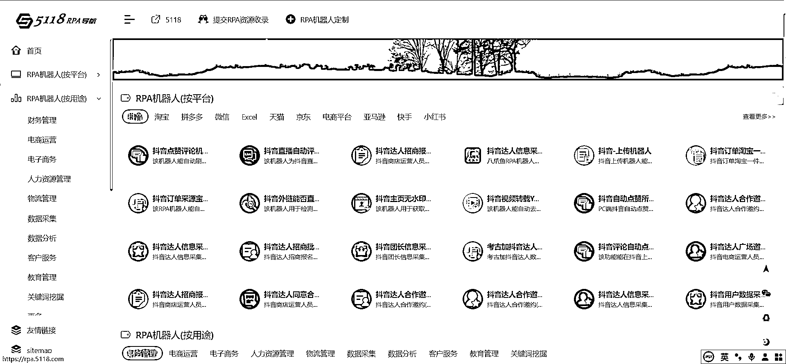
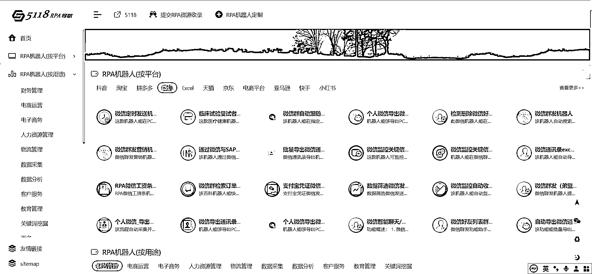
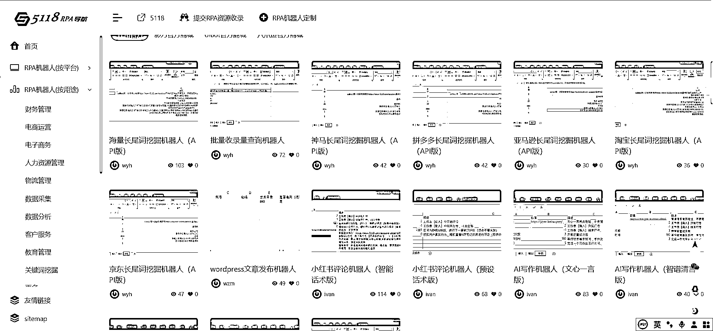
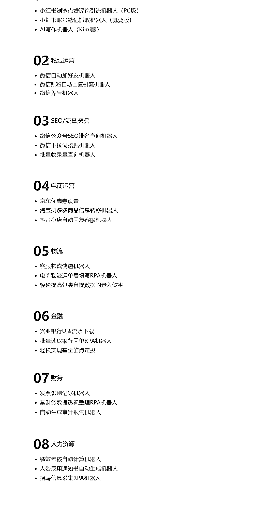

# 5118 上推出 RPA 导航，提供多个实用机器人，助力自动化操作和数据采集

> 原文：[`www.yuque.com/for_lazy/xkrm14/at8w139o5vu5bfh8`](https://www.yuque.com/for_lazy/xkrm14/at8w139o5vu5bfh8)

作者： 六经注

日期：2024-03-26

点赞数：**104**

* * *

正文：

5118 上多了个 RPA 导航，聚合不少挺好用的机器人： *矩阵号的批量自动化操作（评论、点赞、互动之类）能找到不少、相当于多了个现成助理。*
电商、私域或者自媒体数据采集想解放双手的也可以研究一下。

* * *

评论区：

* * *

公众号懒人搜索，懒人专属群分享