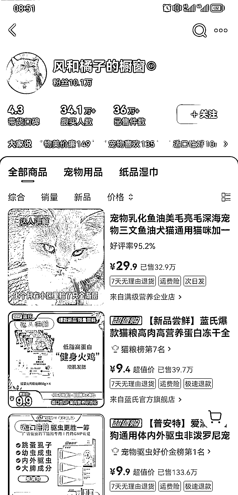
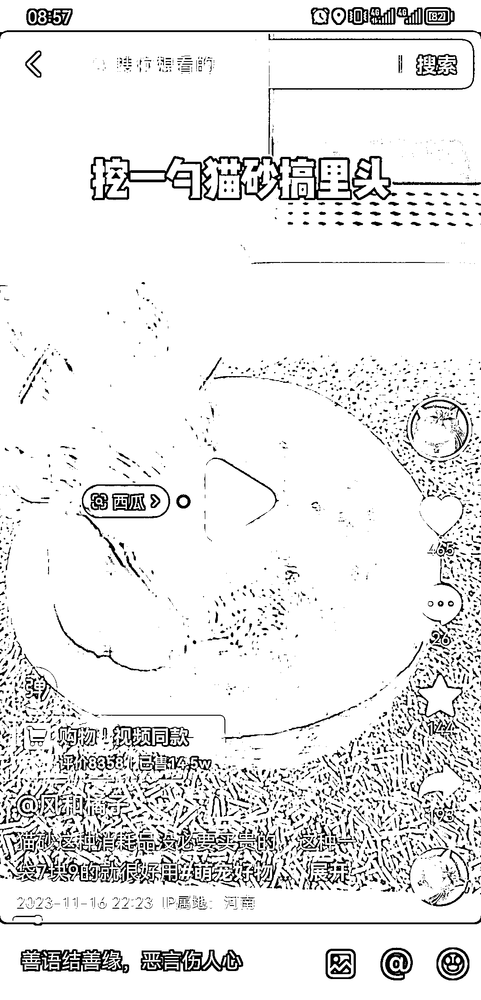
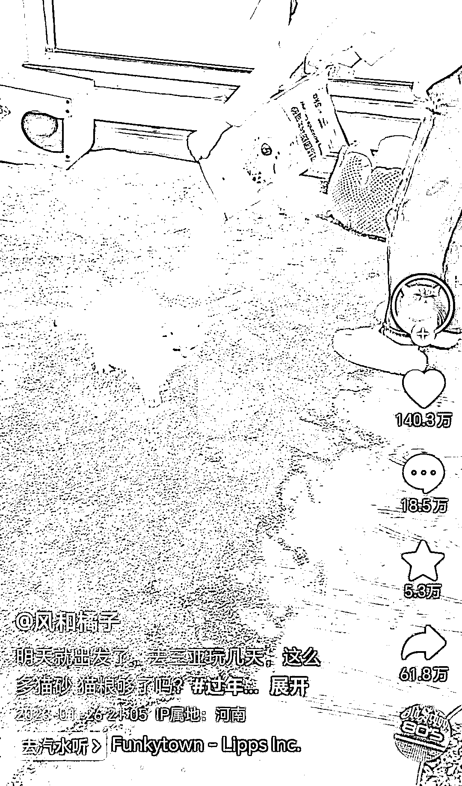
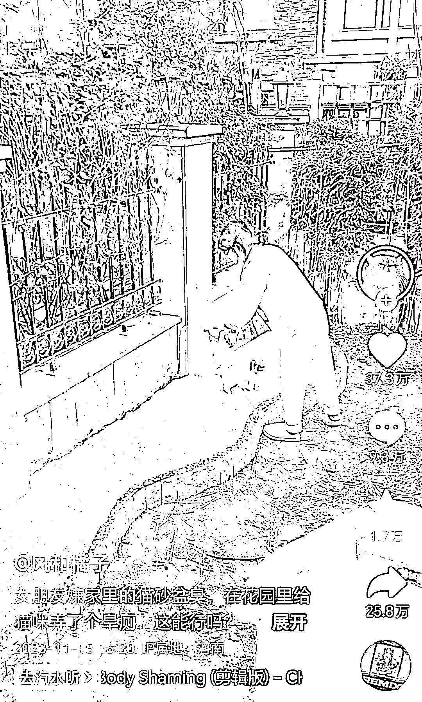
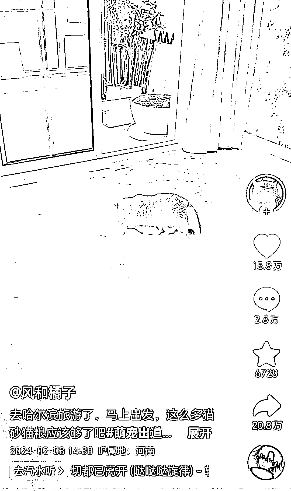
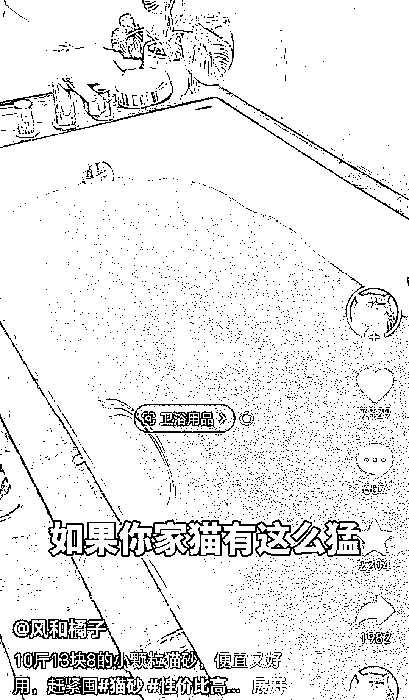

# 奇特场景引爆流量，女子用猫砂创造 36 万件销量

> 原文：[`www.yuque.com/for_lazy/xkrm14/fan4u2hlp9xud68l`](https://www.yuque.com/for_lazy/xkrm14/fan4u2hlp9xud68l)

作者： will 阿伟

日期：2024-03-27

点赞数：**122**

* * *

正文：

这个女人把猫砂视频反复拍，带货 36 万件，她的流量破圈密码就是，奇特场景。至少，视频开头就吸引人，算法一直考核的，就是视频开头这 2 秒！
猫砂放在猫砂盆里，你见过，毫无兴趣。那把猫砂放在西瓜里，你是不是就想看看了？ 出远门把房间地上倒满猫砂，奇特场景，这条视频 140 万赞！
再来，把花池里倒满猫砂，奇特场景，于是拿到了 37 万赞！ 阳台房间上铺满猫砂行不行呢？还是奇特场景，这条视频又拿了 15 万赞。
这个流量密码真的有这么好用？没错，浴缸里堆满猫砂，还是 7000 多赞，屡试不爽。

* * *

评论区：

Denggh : 反差感是获取流量最强的手段

何兮 : 感觉跟老人特效有异曲同工之处，利用反差感

云珞 YunL : 反差感吸引人

* * *

公众号懒人搜索，懒人专属群分享