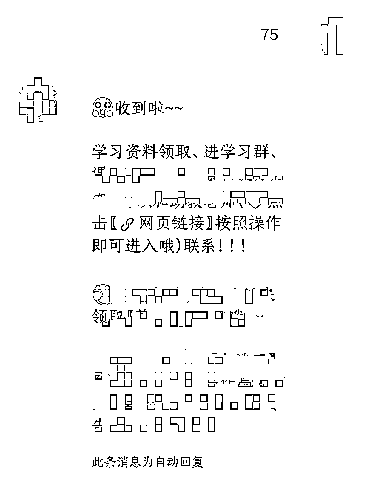
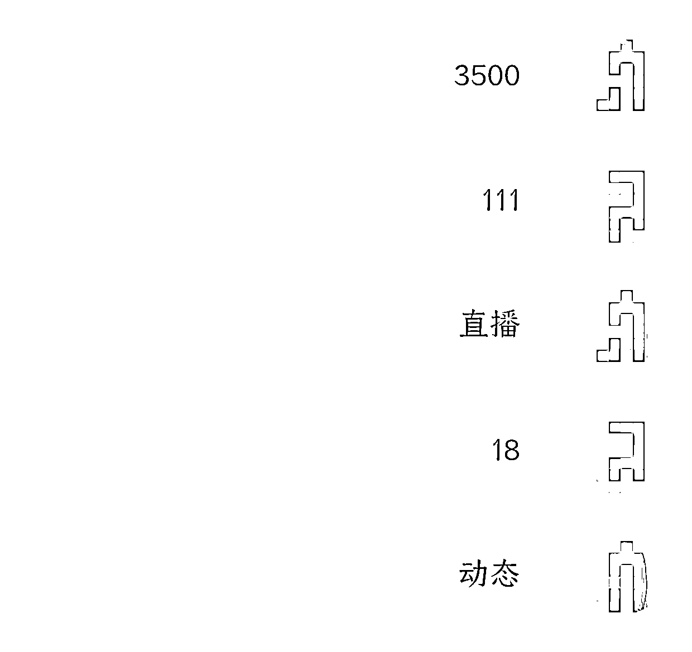

# b 站引流规则变更，私域引流需求增大

> 原文：[`www.yuque.com/for_lazy/xkrm14/yow9vw9dg2avg5ed`](https://www.yuque.com/for_lazy/xkrm14/yow9vw9dg2avg5ed)

作者： 野生行家

日期：2024-03-29

点赞数：**59**

* * *

正文：

关于 b 站私域引流 一向引流宽松的 b 站，在 315 之后也更改了引流规则。 1，之前的外链全部失效，哪怕是触发关键词，在 up 端可以看到，但是在用户端就没有显示；
2，之前的蓝链还可以发私信，或者触发关键词，但是现在都只能放评论区和动态回复
引流规则的改变意味着机会，我们之前每个月引流都在大几千甚至过万，现在也没有只能去充值起飞了。 有搞短链服务的朋友，可以关注一下这块，需求还是蛮大的[呲牙]

* * *

评论区：

野生行家 : 这是中标了吗？[色]

野生行家 : 再补充一点，这几个月找了很多市场上做短链的，只有一家可以做 b 站的，其他都是抖快的。后来问了下，那哥们挺喜欢在 b 站看视频，顺手就做了这个[呲牙]

小涛 : 学科项目 现在做 收益怎么样

野生行家 : 我们这个不太行，产品跟不上，跑偏了，不过竞品做的很棒

* * *

公众号懒人搜索，懒人专属群分享